#+STARTUP: inlineimages
#+TITLE: AI Pair-Programming Case Study
#+OPTIONS: ^:{}
#+OPTIONS: toc:nil h:3

#+OPTIONS: toc:nil num:nil
#+LATEX_CLASS_OPTIONS: [letterpaper]
#+LATEX_HEADER: \usepackage[margin=0.75in]{geometry}

#+LATEX_HEADER: \usepackage{titlesec}
#+LATEX_HEADER: \usepackage{enumitem}
#+LATEX_HEADER: \setlist{noitemsep}

#+LATEX_HEADER: \titleformat{\section}[block]
#+LATEX_HEADER:   {\Large\bfseries}         % format (font)
#+LATEX_HEADER:   {\thesection}            % label
#+LATEX_HEADER:   {1em}                    % label separation
#+LATEX_HEADER:   {}                       % before-code

#+LATEX_HEADER: \titleformat{\subsection}[block]
#+LATEX_HEADER:   {\large\bfseries} % format
#+LATEX_HEADER:   {\thesubsection}             % label
#+LATEX_HEADER:   {1em}
#+LATEX_HEADER:   {\uline}

#+LATEX_HEADER: \titleformat{\subsubsection}[block]
#+LATEX_HEADER:   {\bfseries}
#+LATEX_HEADER:   {\thesubsubsection}
#+LATEX_HEADER:   {1em}
#+LATEX_HEADER:   {}

* AI Pair Programming
** Introduction

  I sometimes jokingly refer to myself as a /grey-haired neck beard/. In my case I can back that up. 

  I started programming more than forty years ago, when using a computer could literally involve punching cards and sending them somewhere else to be run. In high school, our computer lab was largely handed to me because I was one of the few people who knew what to do with it. My early professional work included C, embedded systems, and environments where memory constraints were not an abstraction. At one point I modified a home-grown C compiler so it could deal with bank-switched memory because the hardware we were targeting could address more memory than the processor could directly see. 

  Later I worked on systems used to pull consumer credit reports. The existing approach required custom code for the different report types, so I replaced much of that with a data-driven model: definitions describing the inputs, mappings used to construct the requests, and tables describing how the responses should be rendered. New report types could then be introduced largely by changing data rather than rewriting the application. Today we would simply call that data-driven development. At the time it was just the obvious way to stop writing the same code over and over. 

  From there I moved to a company managing medical rehabilitation and therapy centers. We had applications running on both Apple and PC platforms, written using completely different tool chains, and needing to support some of the early handheld computers being used by nurses and therapists. Around that time I started experimenting with a relatively new language called Java, version 1.0.2. Java solved a problem I actually had, so I kept digging.  

  We initially worked directly with Java's AWT graphics APIs, then experimented with tools from Marimba's Castanet platform. Castanet could build graphical Java applications and serialize the resulting interface, so I wrote a tool that decompiled that serialized representation back into Java source we could incorporate into our application. I also became active in the Java Usenet groups, asking questions and answering them when I could. 

  Eventually somebody at JavaSoft noticed and asked whether I would be interested in joining them. My company happened to be going through an acquisition and relocation, so I joined Sun's JavaSoft division as one of its early Java Enterprise Architects on the East Coast. 

  By then software development had become both my profession and, apparently, a very long-running experiment in learning the next thing. 

  After Sun I became Home Depot's first person with the formal title of /architect/, later moving into a director role. Over the years that followed I held architecture and engineering leadership positions at companies including a major public-records provider, Hewlett Packard, a consumer lending company, Equifax, and a SaaS platform serving small service businesses. My work ranged from large-scale application modernization and microservices to engineering leadership, security and PCI programs, and stabilizing growing software organizations. Today I work as a contract Chief Architect helping another growing company modernize its platform and engineering practices. 

  The individual technologies have changed repeatedly over those decades. What has remained remarkably consistent is the pattern: a new tool or architectural idea appears, people argue about whether it changes everything, and eventually we discover where it is genuinely useful. 

  I have usually dealt with those changes in my own way. While I'll read what others say, pro and con, I've found there's really only one way to understand the changes: I have to kick the tires and take it out for a spin.   

** The Problems Don't Really Change, the Tools Do

   Through all of this I have watched technology and software development go through repeated cycles of change.

   In the early days we used time-sharing systems: large centralized computers accessed through remote terminals.  The PC revolution moved much of that processing onto the user's desk.  As businesses needed to share data, we moved toward client/server systems, with desktop applications talking to centralized databases.  The Web then began pulling more of the application back onto centralized servers, accessed through increasingly capable browsers.  
 
#+CAPTION: AI-generated illustration of mid-1970s time-sharing terminal
#+ATTR_HTML: :width 256x :height 256px
#+ATTR_LATEX: :width 1in :height 1in
#+ATTR_ORG: :width 256px
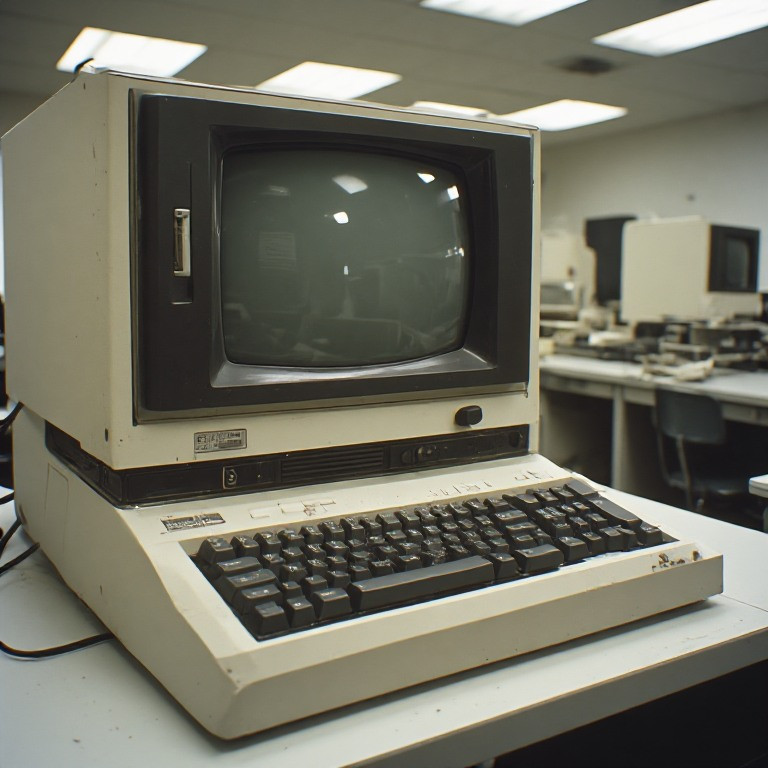

   In some ways we have come almost full circle.  We went from centralized computers accessed through terminals, to powerful standalone computers on every desk, and then back toward centralized applications accessed through what had become very sophisticated terminals. 

   The implementation details were radically different, of course, but the motivation behind each change was remarkably consistent: improve efficiency, make systems easier to support, allow information to be shared more easily, and reduce the amount of specialized work required at each user's computer.  Software development itself followed a similar path. 

   We moved from machine code and assembly languages toward higher-level languages such as FORTRAN and COBOL. Structured programming gave developers better ways to control increasingly complex applications. Object-oriented programming introduced another way to organize that complexity around objects and responsibilities.  Graphical interfaces pushed us toward event-driven programming.  The Web drove new distributed architectures and communication models.  Cloud computing later abstracted much of the  infrastructure itself, while DevOps and CI/CD attempted to make building, testing and deploying software faster and more repeatable.  

   The way developers worked together changed as well.  Waterfall development gradually gave way to more iterative approaches.  Extreme Programming, introduced in the 1990s, formalized practices such as pair-programming, where two developers work together on the same problem.  One may be writing the code while the other reviews, questions assumptions, considers alternatives and thinks ahead.  Those roles can switch constantly during the session. 

   The Agile movement expanded the larger idea: shorten the feedback loop.  Build something, test it, learn from it, adjust, and repeat. 

   Looking back across all of these changes, I see a common thread.  We keep inventing new abstractions, tools and processes in an attempt to tame complexity and give people more leverage.  Sometimes a new idea really does change the industry.  Sometimes it is mostly a new version of something we have done before.  Usually it is some combination of the two.
   
   What rarely changes is the underlying goal: do more useful work, with less unnecessary effort, while retaining enough control to understand what the system is actually doing. 

** Generative AI

   Then generative AI arrived.

   The reaction was hard to miss.  On one side were increasingly ambitious claims about AI replacing developers, autonomous agents building entire applications, and companies reducing engineering staff because software could now be generated instead of written.  On the other side were developers looking at poorly designed or poorly reviewed AI-generated code and dismissing the result as /AI slop/.
   
   Both reactions contained something real.

   AI could clearly generate useful code, explain unfamiliar APIs, summarize documentation, suggest designs, and produce working examples at a speed that was difficult to ignore.  It could also generate code that looked perfectly reasonable while being subtly wrong, unnecessarily complicated, or completely inappropriate for the system around it. 

   None of that was particularly surprising to me.

   Poor software existed long before generative AI.  So did over-engineering, bad abstractions, copied code that nobody really understood, and developers using tools without understanding what those tools were doing.  Generative AI appeared capable of producing good work faster, but it could just as easily produce bad work faster if nobody was exercising engineering judgment. 

   I also began seeing AI appear in places far beyond writing code.  Job descriptions increasingly mentioned AI experience.  Resumes were being written or screened with AI.  Interviews were beginning to include questions about AI-assisted development, while candidates were themselves using AI to prepare for those interviews. 

   Clearly something was changing.

   I didn't know exactly where I stood on it, and reading arguments for or against it was not going to answer the question for me. So rather than argue about what AI might be capable of, I decided to find out for myself. I would build something with it. 

** What Was I Trying to Build

   Most people have at least heard of Minecraft. It is a 3D open-world survival and building game, and the Java edition has developed an enormous ecosystem for extending what the original game can do. 

   There are several ways to do that. Mods can fundamentally change the game by adding new blocks, items, creatures and mechanics, but mods generally require compatible software to be installed on both the client and server. Plugins take a different approach. They run entirely on server platforms such as Paper, Spigot or Purpur and allow an ordinary Minecraft client to connect without installing anything special. Mojang has also added its own datapack and resource-pack capabilities over the years, increasingly blurring some of those boundaries. 

   I was specifically interested in the plugin approach. I wanted to see how far I could push a standard Minecraft client using only server-side code and the capabilities Mojang already provided. 

   I had three ideas.

   The first was sailable ships, a feature that has been implemented multiple times in Minecraft's history.

   One of the oldest solutions is a plugin called /Movecraft/, which allows players to construct vessels from ordinary blocks and then move them around the world. Its approach is essentially discrete movement: relocate the blocks that make up the vessel from one position to another in one of the cardinal directions. Years ago I had played with a mod called /Davinci's Vessels/, where a structure assembled into a vessel that could move and turn smoothly, much more like an actual Minecraft boat. 

   I wanted that experience without requiring a client mod.

   Mojang had recently added *Display* entities to Minecraft, and I had an idea that they might provide the missing piece. That experiment became /SimpleShips/. 

   The second idea came from wanting something interesting to do once I had ships sailing around the world. Minecraft has treasure maps, but I wanted something more adventurous. Another game I had played, /Atlas/, placed floating bottles in the ocean containing maps that led players to guarded treasure on distant  islands. 

   I wanted my own version of that idea. That became /Dead Man's Chest/.

   Finally, I wanted to see whether a plugin could effectively introduce new building geometry. Modded Minecraft has long had building systems with roof pieces, slopes and other shapes that the vanilla game does not provide. Other building games commonly offer triangular pieces, and I had often wished Minecraft did as well. 

   That experiment became /Ramps and Wedges/.

   So I had three projects, each intentionally pushing at something plugins were not obviously designed to do: smoothly moving structures, more elaborate treasure-map adventures, and what amounted to new block geometry without actually adding new blocks. 

   I had played with the plugin APIs before, but never substantially. Getting started presented another problem. The Bukkit and Paper APIs together contain thousands of classes, interfaces and enumerations, along with supporting libraries such as JOML. The documentation is extensive as API reference material but often sparse when it comes to explaining how the pieces are intended to be used together. There is also considerable history in those APIs, including functionality retained for compatibility with older versions of Minecraft. 

   I knew how to design and write the software. What I didn't know was where all the pieces I needed were hiding. 

   That was when I thought about using AI.

   A colleague had mentioned some time earlier that he increasingly used ChatGPT instead of a search engine when trying to find technical information. Rather than construct a series of searches, sift through results and piece together an answer, he could describe what he was trying to accomplish in natural language and let ChatGPT help point him in the right direction. 

   That seemed like a useful experiment in its own right. I would use ChatGPT as a research assistant to help me navigate unfamiliar APIs and find likely approaches to the problems I was trying to solve.

   What started out with me using AI as a research assistant became what can only be described as a pair-programming arrangement, one that gave me real insight into just how much power this type of collaboration can deliver. 

* SimpleShips

#+CAPTION: AI-generated icon for the SimpleShips project
#+ATTR_HTML: :width 256x :height 256px
#+ATTR_LATEX: :width 1in :height 1in
#+ATTR_ORG: :width 256px
file:./images/SimpleShipsIcon.jpg

** Could This Actually Work?

   The /SimpleShips/ plugin idea started with a question - with the newest capabilities available in the Minecraft platform, would it be possible to substitute existing blocks with new *BlockDisplay* entities, then smoothly move those around in the game?

   As I've mentioned previously, back in the Minecraft 1.7.10 days I was a big fan of the Davinci's Vessels mod where a ship could be constructed from regular blocks, then a special helm block was placed that could be interacted with.  The ship could be assembled and then move and rotate as a single vessel rather than individual Minecraft blocks.

   Entities, unlike normal blocks, are not restricted to placement on the grid boundary, and they can be rotated 360 degrees. In version 1.19.4, Mojang introduced *Display* entities that could reproduce the appearance of blocks or items with the flexibility of an entity. Normal game entities are active participants in the world, with behavior that may be updated every game tick, making large entity-heavy structures potentially expensive. *Display* entities were designed primarily for visuals and do not carry that same active behavior. Theoretically, I should be able to use these new features to replicate what Davinci's Vessels provided. I wanted to see if I was right.

** Setting Up the Collaboration

   I started the project by creating a new ChatGPT context and explaining that I would be building a Minecraft plugin for a [[https://papermc.io/][PaperMC/Bukkit]] server, using the AI primarily to help me understand the available APIs. I had already cloned a sample plugin project and wired Emacs into the Gradle build. I was using ChatGPT through the regular web interface rather than integrating it directly into my development environment, so the workflow was simple: ask questions in the chat, review the responses, and adapt what was useful into my code.

   Early on in the process, each time I'd make what I felt was a simple statement of what I was doing, the AI would generate long responses with suggested code or suggested capabilities to make use of.  When I first provided a copy of the sandbox plugin Java code, the AI returned an updated version and pointed out several things to watch out for. As an example, I had a very basic command handler in place, the AI pointed out that non-players could trigger commands and I should explicitly handle those.  It then provided me with direction on how to create new commands in the plugin's config.yml file and wire them into code. It also suggested tagging any entities my plugin created with a plugin-specific *NamespacedKey*.

At the time, that looked like just another useful implementation suggestion. Looking back, it was one of the earliest hints of a pattern that became foundational across all three plugins: let the objects created by the plugin carry their own identity and state.

** Working Prototype - Sandbox
   
   For the sandbox experiment I tried to follow the model of the Davinci's Vessels, I wanted a custom /helm/ that the player would interact with.  I had reviewed a number of datapacks that produced decorative items by creating textured /player heads/.  I provided a snippet of code from one of those datapacks to the AI and it explained the various components of the JSON.  It then identified from the Paper APIs some classes I would likely need to copy the functionality of the datapack.  I located a player head texture of a ship's helm and implemented the suggested code pattern using it.  I also set up commands that I could run from the client to give the player a helm.  I got that working, spawned in the head, attached it to an armor stand and decided I didn't like the look.  It was basically a /wheel/ attached to the side of a wooden block.

#+CAPTION: Player head model on left, Davinci's helm on the right
#+ATTR_LATEX: :width 2in :height 1in
#+ATTR_ORG: :width 256px
    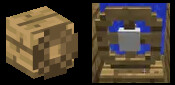
    
   I captured an image of the block and an image of the Davinci helm and presented both to the AI asking for suggestions to get something that looked like the latter.  I even commented that I knew there was a capability for custom models using resource packs and thought that might be acceptable.  The AI agreed, the player head approach would never provide what I was seeking and said that the custom model + resource pack was likely the best way to go, but it did also suggest a multi-part display entity model option.  As with the early *NamespacedKey* suggestion, if this were a mystery novel these would both be considered foreshadowing events.  The AI went on to suggest a phased approach -

   1. make the helm as an item model and bind it to a custom item like a stick
   2. use it in-game as an item
   3. render it as an *ItemDisplay*

   I went searching and found the [[https://blockbench.net/][BlockBench]] tool and was able to use it to create a model and texture I liked.  I wanted to use it and configure the resource pack to be a /server resource pack/ that the player would be auto prompted to download.  The AI then provided the resource-pack JSON and the Paper-side wiring needed to create the custom item, give it to the player, and have the server prompt clients to load the resource pack.

   As I worked through this initial phase I noted that the AI was providing standard code patterns for developing a plugin, examples of which could generally be found if someone searched for it.  That was expected knowing how the AI models are trained, but the thing I did notice was how it was providing approaches and answers to questions in mere moments.  And it was demonstrating how it could evaluate multiple possible solutions in real time and present alternatives such as with the two helm approaches. The speed I had expected, what surprised me was how quickly it could evaluate several plausible approaches and present the trade-offs between them. That felt familiar. It reminded me of whiteboarding sessions with senior architects where we would throw different approaches at a requirement and debate which one best fit the problem.

** The AI Can Work Visually

After wiring this up and firing up the game, I gave my character the helm item and captured an image of the result. I shared the picture with the AI, which responded, “Nice, and that screenshot makes the direction very clear.”

#+CAPTION: Me holding the BlockBench created model for a helm
#+ATTR_HTML: :width 256px :height 256px
#+ATTR_LATEX: :width 1in :height 1in
#+ATTR_ORG: :width 256px
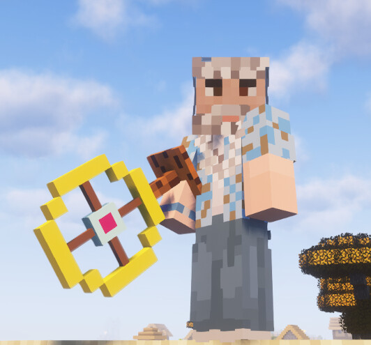    

   I knew the AI could evaluate images. What I had just learned was that it could use visual feedback to influence the next design decision.  At this point the AI suggested how I should go about using the new helm, not as a placed block, but as a /control object/ that was actually built from an *ItemDisplay* and an *Interaction* connected together by an ID.  This was my first exposure to the *Interaction* and the AI continued on providing details about events that are triggered when the player right clicks one of these entities. The AI also said I needed to hook the block placement event to allow the player to place the item into the world. I now had the information I needed to create a helm, place a helm and know when the player clicked on the helm.

   There needed to be some type of feedback to the player when they clicked the helm.  Looking back to my inspiration, when clicking the Davinci helm the player would be presented with a menu allowing for naming of the ship, assembling and disassembling the ship, mounting and dismounting  the ship and aligning the ship.  I wanted something similar and had used other plugins that used the inventory interface with selectable items to trigger events.  I posed the idea to the AI and it provided direction on setting that up.  I had the same options Davinci's provided aside from naming of the ship.  Following the guidance, I added the code and now when the player clicked the helm, the inventory would open up and clicking an item triggered another event.  One thing I did notice about the AI code suggestions was that it was good at being comprehensive.

** The AI Was Looking Ahead

   What I mean by that is when it provided the approach for how to present the /menu/ and how to handle events when the player clicked an item, it also provided direction of how to prevent the inventory item from being dragged or moved.  This was obviously the behaviour that I would want for a menu like this, but I hadn't actually articulated it.  I knew AI models were trained on large collections of existing technical material, so it wasn't surprising that the response reflected common implementation patterns for this kind of menu.  This time the AI was including the little details that would eventually be necessary to have in a robust system, well before any testing showed the problem. Had I researched and built the menu myself, I’m not sure I would have thought to prevent item dragging in the first iteration. I likely would have found it during testing. In this case, the AI surfaced the edge case before I encountered it, saving a development/test cycle. It was a small example of something we used to call RAD—rapid application development—but with one more robustness detail already accounted for.

** My Experience, Augmented by AI
   
   On to the next step, ship assembly.  Here I used my own experience to implement a BFS flood algorithm to identify blocks that could be included in the assembled ship.  I already knew how to implement a standard BFS flood search: start from an anchor block, walk outward in six directions, reject blocks outside the allowed material set or ship bounding box, and collect the rest.  The code captured the *Location* for each identified block into a collection to be further processed. Here I asked the AI to do a code review of the ship assembler code and it made two recommendations that I adopted. First, it suggested that I not use the helm's position as the anchor point, but the block the helm was sitting on.  That was a real block which would ensure there was at least one block found.  The second suggestion was to not have a collection of *Location* objects as the outcome, but to define a Java /record/ that took in a *Location* and could be enhanced later as more data needed to be captured.  Things were coming together, I was now to the point of having identified a /ship/ based on a player's action.

   Now we had reached the key to my question, what happened if I replaced the real blocks with *BlockDisplay* entities?  The first thing I needed to understand was how to configure a *BlockDisplay* to look like the source block.  I had assumed it would have to do with the *Material* the block was made of, similar to how we used *Material* values with *ItemStack* objects to make the item in inventory look like what we wanted.  Turned out there was more to it.  The AI pointed me to the *BlockData* attribute of regular blocks which is basically the captured state of a block, including the correct *Material*.  A *BlockDisplay* is configured by giving it a *BlockData*.  I now understood the previous suggestion to create a /record/ to capture block information during assembly.  During the assembly operation I was now retrieving the *Location* and *BlockData* from each connected block and capturing that in my assembly record.

   For my first real test, then, all I needed to do was loop through the collection of assembly records, remove the physical block by setting its type to *Air* and creating a *BlockDisplay* using the captured *BlockData*.  This is what I did and for the first ship made up of a collection of oak planks, it worked.  Upon ship materialization, my player immediately fell through the *BlockDisplay* entities and into the water, exactly what used to happen with Davinci's.  I now had a ghost ship, I needed some way to keep the player attached to the ship, and that meant I needed a seat.

   I already knew there was a concept in the existing system of a /vehicle/ that could take entities. I was also aware that the *ArmorStand* entities could take a passenger, as this was something I had seen used in other plugins and datapacks, and when I saw that I could disable gravity on the armor stand, this is what I decided to use.  When the player would assemble the ship, I would spawn in an *ArmorStand* and mount the player on it.  Another request for a code review and the AI's next suggestion was that I should create a *Helm* class and *HelmListener* and also a *Chair* class and *ChairListener*.

** From Prototype To Structure

   Many of the suggestions being made by the AI were not always technical implementation details, but were often related to structural details.  The AI regularly recommended approaches to implementation that followed good object oriented practices such as organization into manageable components. For example, the *Helm* and *Chair* classes would own creation and destruction of the various components and entities that were part of them, the *Helm* would own the *unique identifier* for a ship, the listeners would handle the events against the *Interaction* entities, find the associated helm and hand off the event handling.  These were not novel patterns, but they were the kinds of structural decisions that kept the prototype from turning into a pile of event-handling code as it grew.

   This is also when the use of the *PersistentDataContainer* capability started to grow.  Each component that made up the helm or the chair would be tagged with the unique ID of the helm using a common key.  Any activity that pulled up one of these components would then allow tracing back to the master helm component.  This model was more like foreign keys in database records than object composition in OO programming, but it used the machinery of the API to achieve similar results. At the time, this led me to keep simple hash tables of the created helms and chairs in the plugin for convenient runtime lookup. This, in turn, provided a mechanism for me to add a cleanup command that could locate and remove helms and chairs.

** The Rotation Jungle
   
   With this refactoring in place, I was now creating a /chair/ that consisted of an *ArmorStand* and a wool block that was added to the stand's helmet equipment slot.  The problem I ran into is I was spawning this in on the same block the helm was occupying, I needed to move it away, and this is where I ran into Minecraft's legacy systems that the AI had to explain.  What I wanted to do was simply move 1 block away from where the helm was, in the direction opposite to where the helm was facing.  Minecraft has multiple different mechanisms for determining direction, depending on the situation.  There is *BlockFace* which identifies one of 19 directions (though *SELF* didn't come into play).  Then there's different types that a *BlockData* object could implement - *Directional*, *Rotatable*, *Orientable*, even a *MultipleFacing*.  And then there's the *Location* component of everything in the game, it has a /yaw/ (and /pitch/) value.  In the source code for /SimpleShips/ there is a *UtilFunctions* class, and nearly every utility function is related to block rotations.

   But the AI was able to navigate all of these variations, and for this particular situation it suggested normalizing the player's /yaw/ to the nearest cardinal direction when the helm was placed. From that single canonical facing I could derive the helm's forward direction, the opposite direction for chair placement, the vector offset for the new *Location*, and the rotation needed to keep the *ArmorStand* facing forward. All of these various rotation approaches would come into play later as more block types were allowed on the ship.

** From Components To Ship

   Next test: place the helm, open the menu, assemble the ship. The chair spawned, the player mounted it, and the physical blocks were replaced with *BlockDisplay* entities. Now I needed the reverse operation: disassemble the ship and restore the physical blocks.

   I also found that the player could simply dismount the chair and immediately fall through the virtual ship, just as happened in Davinci's Vessels. I didn't want that behavior, so I hooked the *VehicleExitEvent* in the chair listener and prevented manual dismounting. That made the menu's dismount action responsible for removing the player safely.

   It was at this point I created the actual *Ship* class as I was needing to capture many pieces of information, such as a helm, a chair, the captured source blocks, a list of *BlockDisplay* entities that were created, this ship's canonical /forward/ direction.  I did some refactoring and removed the helm and chair hash tables from the plugin, added a new one to track a ship.  The helm was still the starting point, so the *Ship* would be created at the point in time where the player placed a helm item into the world.  The *Ship* would own the unique ID and assign it to the helm and chair. I removed the separate helm and chair hash tables and replaced them with a single registry of ships.  The cleanup code could now iterate through all known ships, force them to disassemble and remove the helms and chairs.  The *Ship* would be responsible for managing all actions on the ship - assembly, disassembly, alignment, mounting and dismounting the /pilot/ and the  movement calculations.

   After the refactor, I rebuilt and repeated the test. The helm opened the control menu, assembly created the chair and virtualized the blocks, and disassembly restored the ship, removed the chair, and dismounted the player correctly.

** Can It Move

   Now for the final prototype test: could it move smoothly? I knew movement would require a recurring update loop. The AI showed me how to schedule one through the plugin API, while cautioning against running it every game tick unless I actually needed that frequency. I wired the loop so each update was sent to the known *Ships*, added temporary commands to start and stop movement, and verified that an assembled ship was receiving updates.

   The movement algorithm was pretty basic.  Since I was only doing water surface ships and not flying ships, I could treat it like traditional 2D movement. Based on the angle of rotation and speed I simply needed to calculate the delta offset changes for the X and Z locations, apply them to every *BlockDisplay* in the *Ship* and it should work.

   I did that and the initial experiment did work, mostly.

   I was using the teleport feature of the *BlockDisplays* to physically move them.  The blocks moved, but the helm and player didn't.  Oops, forgot I needed to update their locations as well, so I added that. Now the blocks and the player moved. Success.

   Next I added turning. Updating the ship's yaw was easy enough, and the next movement calculation correctly sent the displays in the new direction. But while their positions changed, the individual displays themselves did not rotate with the vessel. Gaps immediately appeared between the blocks.

** Entering the Rotation Jungle

   I gave the AI the movement code for review and it provided the explanation I needed, again related to the rotation issues.  The way I was moving the ship was by determining each block's new location and teleporting it to that spot.  What I wasn't accounting for was that the *BlockDisplay* had its own orientation state in addition to its world position.  This was also an area where the AI was particularly useful because 3D transformation math has never been one of my strongest areas.

   I now had a situation where I had a direction of movement for the ship, an existing direction of rotation for a block and I was turning the ship.  My first attempt was to simply update the /yaw/ of every display entity's *Location* with the same amount the ship was turning.

   Again, this mostly worked, the regular blocks seemed to be okay.  But when I tested a few other block types such as furnaces with defined direction, I saw they had issues.

  The AI suggested that I stop treating each captured block as having an independent world location. Instead, I should store each block's offset from the ship's anchor and express that offset through the display's transformation matrix. This was familiar territory conceptually; I had used the same approach when loading 3D models, where every component is positioned relative to a common origin.

  I then incorporated the ship's yaw into that transformation as a quaternion. With position and rotation now relative to a common anchor, moving or turning the vessel became conceptually much simpler: update the anchor and apply the shared movement and rotation relative to it.

   And it worked, mostly.

** Timing, Cloning and Sequencing

   I was noticing that every so often the virtualized ship would not appear when assembled.  When I teleported my player to world position (0,0,0), where I was initially creating the entities,  I would see the ship display blocks had been spawned in. The problem turned out to be a timing situation with the plugin, the anchor-relative transform was correct; the mistake was spawning the displays at (0,0,0) and then moving them. I discovered I could spawn them directly at the helm's location and let the transformation offsets position them correctly.

   That resolved the first issue, but then on movement the block would still have some odd placement issues.  This turned out to be caused by the fact that when I spawned the display items in I passed it the *Location* object I had retrieved from the helm, which subsequent teleport commands would update. The AI pointed out that I was effectively sharing one mutable *Location* object between multiple displays. Each entity needed its own cloned *Location*.

   Reassembly exposed another problem: some blocks, especially connected fences, did not restore correctly. The AI explained how Minecraft performs neighbor updates when blocks change, which pointed me toward the sequencing issue.

   During assembly, I was discovering a block, capturing its *BlockData*, removing the block, and then moving to the next block. Removing the first fence caused Minecraft to update the neighboring fence before I had captured its state. By the time I reached it, I was saving the already-modified version.

   The fix was simple: separate discovery from removal. First identify every block and clone its state. Then create all of the displays from that captured snapshot. Only after that should the physical blocks be removed.

   Once those gotchas were resolved, I could assemble a ship, mount the player, move and rotate the vessel, and restore it to physical blocks. Movement was still controlled through slash commands, though, and I wanted something that felt like actually piloting a ship.

** Introducing The Pilot

   I was familiar with how other plugins captured player movement through packet manipulation and Minecraft’s NMS internals. Those APIs were highly version-specific, often requiring separate implementations for different server versions. I wanted to avoid that if possible, so I asked my research assistant what alternatives existed.

   The AI directed me to a newer experimental Bukkit event, the *PlayerInputEvent* capability.  If this worked as advertised, I should get an event every time the player performed any movement action, with the *Input* object providing flags for what type of action without needing to use the NMS.

   I wired the event into the helm listener and added a simple player-to-ship mapping when a pilot mounted. When a *PlayerInputEvent* arrived, I could determine whether that player was piloting a ship and pass the *Input* state directly to the corresponding *Ship*. The ship's normal update loop then translated that state into movement and steering.

   I rebuilt the plugin, fired up my Minecraft server, mounted my ship and - it worked.

   The movement still needed tuning, but I had answered the original question: *yes, it could be done*.

** The Real Thing

   Proving that the ship could move was one thing. Turning the prototype into something I could actually use meant dealing with the details.

   One of those was restoring directional blocks after the vessel had turned. Stairs, furnaces and other oriented blocks could not simply be put back with their original state if the ship had changed direction. This was another place where I readily leaned on the AI because 3D rotation logic has never been one of my strengths. It produced utility functions for applying the ship's yaw change across Minecraft's various orientation models - *Directional*, *Rotatable*, *Orientable*, and *MultipleFacing* - which gave me a practical way to restore blocks correctly.

   Inventory was another requirement. A chest full of supplies needed to still contain those supplies when the ship rematerialized. I extended the assembly record to capture cloned *ItemStack* contents for *Containers* along with their block state. That worked for chests, barrels and furnaces, aside from another Minecraft special case I would meet again later: double chests share one inventory.

** From Prototype To Product

   I was now ready to start expanding the ship build possibilities by adding support for other block types, but the codebase was honestly a bit messy.  One area that needed rework was the lifecycle of a *Ship*.  A *Ship* was created when a helm was placed and then retained in an in-memory hash table.  If the server was bounced, the plugin would no longer have any *Ship* objects.  I wanted to avoid storing details in external configuration files if possible, so the AI suggested a rehydration.  On world startup the plugin would scan for every *Interaction* entity, see if it was one of my plugin's by checking for the presence of a persistent data value, and seeing if it was part of a helm, then reconstruct the *Ship*.  I also had to hook the chunk loading event to do the same thing.  This worked, but felt /clunky/.

   I also had come to the decision that the whole ship operational approach, the required resource pack for the helm, the menu, etc. wasn't really working for me, so I set up a new plugin project, and began refactoring the code and moving parts over to the new project.  This time around I removed the custom model helm and captain's chair.  Instead I chose to go with a multi-item model consisting of a fence post with a resized spruce trap door as the helm and seat combination.  This looked like a little stool, the player could place it where they wanted it and that is where the ship would be controlled from.

#+CAPTION: New pilot seat made only from BlockDisplay entities, no custom model   
#+ATTR_HTML: :width 303px :height 134px
#+ATTR_LATEX: :width 1in :height .75in
#+ATTR_ORG: :width 256px
   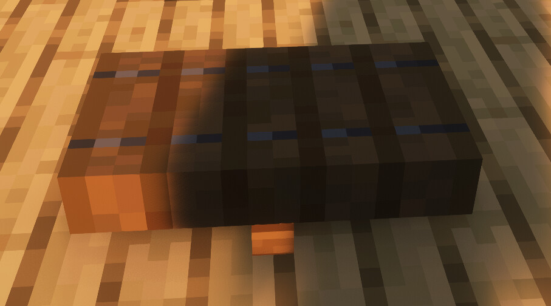

   As this was going to be the seat, I removed the *Interaction* entity from this composite and replaced it with an *ArmorStand* that could respond to the same events.  I also simplified the interaction, right-clicking on this new helm would automatically assemble the ship and mount the player.  A traditional vehicle dismount (sneak) would automatically align the ship to the nearest cardinal direction, disassemble the ship and dismount the player. I retained much of the existing event handling, just restructured where it lived.

   This new approach allowed me to eliminate the rehydration need.  The player was allowed to place a helm at any time and the location didn't need to be recorded.  Only when the player right-clicked on the helm to mount and assemble the ship, did the ship itself need to be created. This was one of the places where my own experience most strongly shaped the direction of the plugin. The AI had helped me get to a working prototype, but deciding how the finished interaction model should feel was ultimately a design judgment.

** Re-establishing The Baseline

   After getting all the basics back up and working with this new approach, I provided the full new source to the AI for two reasons.  One, I wanted a code review, same as I would do in a business setting prior to merging changes into an existing codebase.  The second was to establish a new baseline for the AI to follow.

   One idiosyncrasy I found in this way of working was that, as the codebase grew, suggestions could sometimes drift from the current implementation. The AI might rename a class unnecessarily, or a method signature changed even though the existing one was already established. Periodically providing a fresh snapshot of the full source and explicitly treating it as the baseline largely eliminated that problem.  That may simply have been a consequence of using the web interface rather than an IDE integration with continuous access to the full source tree.

** Impact Analysis

   An interesting side benefit I hadn't expected was that, when the AI had access to the full codebase, it could often point out where a proposed change would affect other parts of the system. A change to one class might require a listener update, a constructor change, or adjustments to related cleanup code, and those dependencies were frequently identified before I reached them myself. It was effectively providing a lightweight impact analysis alongside the code suggestion.

   In my past I have headed up change control review boards and prior to any release, we would ask the delivering team to report on their impact analysis for the changes they were making. From what I was seeing in this project, giving the AI access to the full codebase substantially improved its ability to identify likely downstream effects of a change.  In a large organization, that kind of assistance could reduce some of the manual effort involved in impact analysis. This would not be a substitute for review by the teams that understand the surrounding systems, but it could speed up the process and perhaps be more comprehensive. 

** Special Cases and Good Enough

   Once the basic structure was working, adding more block types exposed a different problem: Minecraft has accumulated a lot of special cases. Beds span two blocks. Double chests combine two blocks into one visual. Signs and banners have different standing and hanging forms. Item frames are entities rather than blocks. Some newer inventory blocks implement different interfaces than the older containers I had already handled.

   For the double chest I went back and forth with the AI on approaches. It recommended creating a custom model, but I did not want to return to requiring a resource pack for this feature, so I kept trying different approaches. *BlockDisplay* entities had a transformation capability that I was already taking advantage of for movement and rotation, but a transformation also has a scaling capability that I wasn't using.  So I did a test.

   I determined that if I only created a *BlockDisplay* for the *Chest.Type.RIGHT* and applied a scaling factor of 2 to the X dimension, the produced visual looked like a double chest,  almost.

   There was one small noticeable variance, the chest latch on a double chest is only 2 cells wide, but on my virtual double chest it was 4 cells wide.  I exercised my position as product owner to decide this was good enough.

#+CAPTION: BlockDisplay of a single chest with the width doubled   
#+ATTR_HTML: :width 256px :height 184px
#+ATTR_LATEX: :width 1in :height .75in
#+ATTR_ORG: :width 256px
   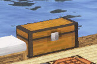
   
   The same pattern repeated with decorative blocks. Banners retained their patterns but showed a pole I did not really want. Signs lost their text, and wall signs needed a custom approximation to avoid an obvious pole. Item frames required several layered displays to get close to the original appearance. In each case, the AI and I explored options, but I deliberately stopped once the visual result was convincing enough for a moving ship rather than chasing perfect reproduction.

#+CAPTION: Physical Viking Longship by ThorHammerhand 
#+ATTR_HTML: :width 480px :height 256px
#+ATTR_LATEX: :width 2.5in :height 2in
#+ATTR_ORG: :width 256px
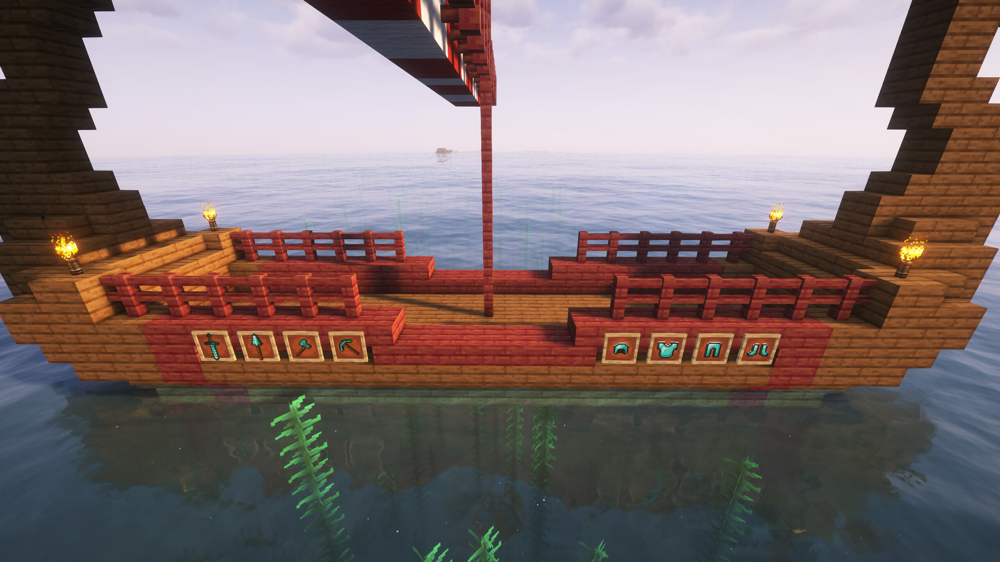

#+CAPTION: Virtualized Viking Longship 
#+ATTR_HTML: :width 480px :height 256px
#+ATTR_LATEX: :width 2.5in :height 2in
#+ATTR_ORG: :width 256px
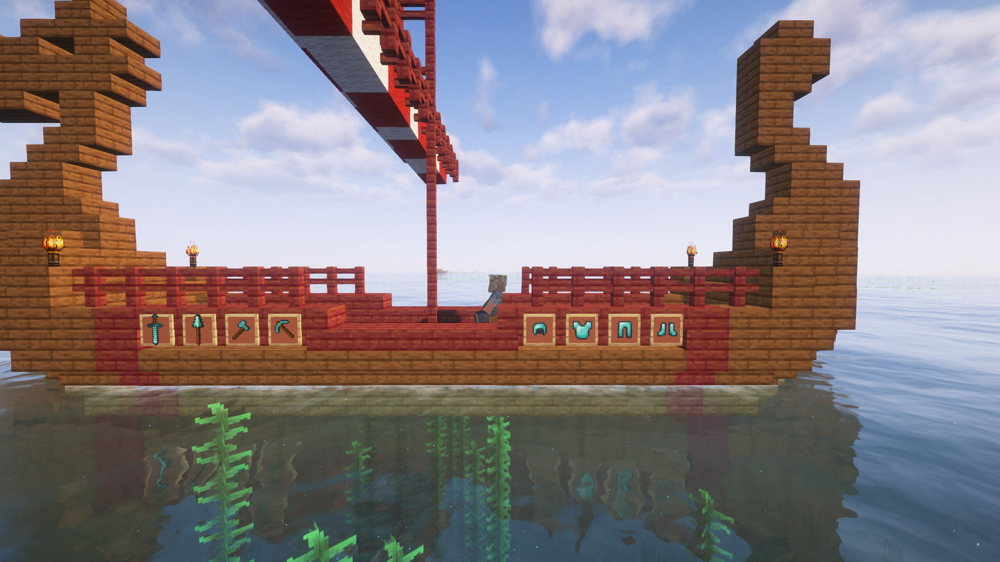

   This became the new working model for me where I would work to get another type of block handled, maybe have to ask for some details about the block but otherwise figure out how to make it look as close to right as possible, but accept if it wasn't perfect.

   Other minor issues, Minecraft had added new blocks with inventory that were not *Container* blocks such as the newer *Shelf*.  Turned out they had introduced a new interface *InventoryHolder* that *Container* was now a subclass of, so I replaced all *Container* checks with *InventoryHolder* checks and now the code supported all known container type blocks. This was one I figured out fairly quickly without the AI's assistance, it was a matter of me seeing what the new *Shelf* block implemented and working backward.

** Collisions
   
   After getting most expected block types working, I needed a way to handle collisions while travelling. Since I was already defining a bounding box for the ship during assembly, my first thought was to project that box forward and test for intersections. I knew that could produce false positives on ships with narrow keels and wider upper hulls, so I asked the AI whether there was a cleaner approach.

   The AI suggested something simpler: for each block about to move, calculate its destination and check what currently occupied that space. For a relatively small performance cost, this gave me an exact collision check.

   This worked splendidly. A ship with a keel in the water and a wider hull above could pass through narrow waterways without false collisions.

   This exposed another problem: a ship could become wedged where it could no longer turn or back out. The AI suggested several approaches, but I came up with a deliberately simple one: when the ship is moving in reverse, I don't perform collision checks.

   This technically allows a ship to back through terrain and could be exploited, but this was one of the places where I chose gameplay over guarding against every possible abuse. I would rather guarantee that a player can recover from being stuck than prevent someone from misusing reverse movement.

   The same philosophy is why /SimpleShips/ has no buoyancy or detailed sailing physics. Other mods and plugins already provide more realistic ship simulation. I wanted uncomplicated fun with sailing ships.

** A Captain Needs A Crew   
   
   The last additions I wanted were the ability to carry other passengers and to carry mobs. The AI suggested several possibilities, but I already had a model in mind. Following Davinci's Vessels, I would provide a custom seat for players and a custom pad for mobs. This turned out to be simpler to implement than I had expected.

   I registered recipes for both items and used the same placement pattern as the helm: placing one generated the necessary *BlockDisplays* and an *ArmorStand* to carry the passenger.

   For the seat, when a player right-clicked it, the event handler mounted them on the *ArmorStand*. For the entity pad, a right-click triggered a scan of the surrounding area; the first nearby living non-water mob found was mounted on the stand.

#+CAPTION: Player seats and mob pads
#+ATTR_HTML: :width 256px :height 256px
#+ATTR_LATEX: :width 1in :height 1in
#+ATTR_ORG: :width 256px
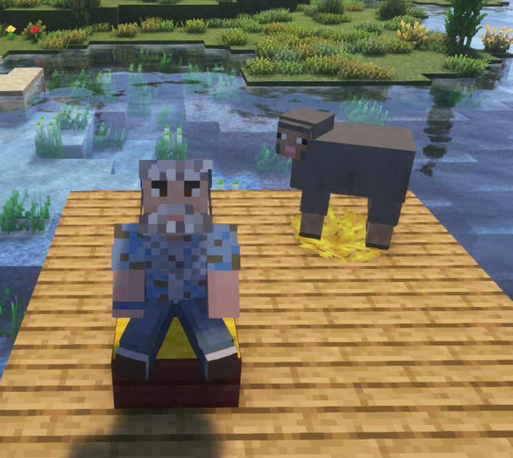

** Parrots, Playtesting and QoL

   I now had working sailing ships that looked good and could carry passengers, pets, containers and decorations. I added a few quality-of-life improvements, including detecting when a player had set their respawn point to a bed on the ship and moving that respawn location with the vessel. I also added a custom perch for parrots so my pirate captain could have one near the helm. Every pirate needs a parrot.

#+CAPTION: Every pirate needs a parrot
#+ATTR_HTML: :width 256px :height 256px
#+ATTR_LATEX: :width 1in :height 1in
#+ATTR_ORG: :width 256px
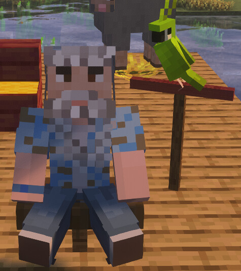   

   I was spending time truly playing with the plugin and I found myself making a boat that became my primary base.  I ran into an issue where I was sailing around and some drowned started hitting me with tridents and I died.  The ship wasn't solid so the tridents passed right through to me.  On dying, the player was no longer mounted but the ship was still virtualized and that actually exposed an oversight that caused some ship loss.  So I updated the plugin to hook the player death event to trigger the normal dismount event to cause the ship to align and restore.

   This also revealed an issue with a grave stone plugin I was using.  Upon dying, the grave stone plugin created a chest at the death location.  Because of how the ship and armor stand seats are set up, the player's location while traveling is the block that the helm sits on, not the space above it.  The grave stone chest was created by the grave plugin, then my death event handler kicked in causing the ship to restore that anchor block into the same space as the chest, effectively deleting it and the contents.

   I described the problem to the AI. It suggested two technically reasonable integration approaches: check whether the gravestone plugin exposed an API, or manipulate event priority so my death event handler ran first. I preferred not to make /SimpleShips/ depend on another plugin as there are many that offer similar functions, and I did not want to make assumptions about handler ordering, so I looked for a simple approach that would solve the problem more generally.

   The rule I settled on was simple: when restoring the ship, if the anchor location was already occupied by a container, do not overwrite it. That protected the common chest-based gravestone plugins without /SimpleShips/ needing to know they existed. Plugins that represented graves entirely with display entities were unaffected anyway. 

** Publishing The Plugin

   I then made my final ask to the AI for this round of work to help me assemble a README.md for my repo and the icon for the project.  I've not really worked with markdown much so this seemed the quickest way and because the AI had been with me through this entire journey where it had given me suggestions and feedback on my thoughts and ideas, it had a full understanding of all the trade-offs or decisions that were made in developing the plugin.

   The README.md file it produced reflected that nicely.

   I made some tweaks to it, added some nice images to the gallery and a demonstration video and then made the repo public.  I created an account on Modrinth and uploaded the jar file.  I copied the README.md into the description and adjusted things that didn't work (like image and video links).  I submitted the plugin for review and in less than two days, it was available for download.

   I am now traveling the open oceans on my server where I use the Continents datapack as part of my world generation configuration so I have large open oceans to sail.

#+CAPTION: My base at sea   
#+ATTR_HTML: :width 256px :height 184px
#+ATTR_LATEX: :width 1in :height .5in
#+ATTR_ORG: :width 256px
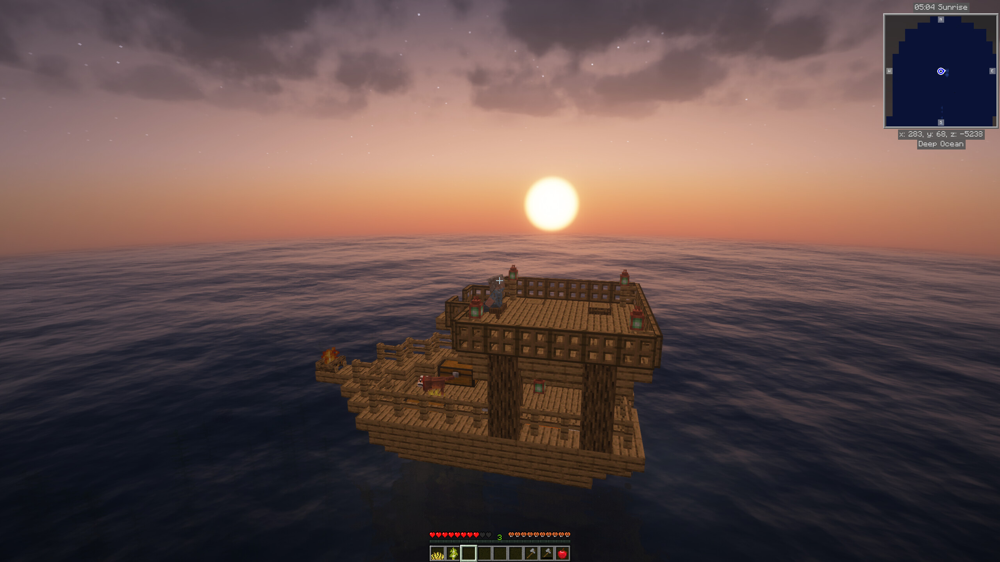   

   And sailing around is a blast, but I started thinking I wanted more to do now that I could sail around, life on the sea needs more adventure than just dodging the Drowned.  And that is when I came up with the idea to build my second plugin, /Dead Man's Chest/.

* Dead Man's Chest   
** The Idea

  In my personal Minecraft server, I have world generation creating a mostly ocean world with islands and continents so that I can sail using /SimpleShips/.  Being able to travel, the world exploration, and the living off the ship can be rather relaxing, but I started feeling like the oceans needed something more.  I threw some ideas at my AI collaborator on ways to liven up the adventure, and one such thought was using /SimpleShips/ as a basis for adding Pillager pirate ships.  The idea has possibilities, but this would start getting into the realm of managing entity control and game AI, something I would like to do in the future with other ideas, but as a second plugin project, it seemed a bit overly ambitious.

  Then I had a thought, I play another game called Atlas, where players build ships and sail around battling pirates, building bases and finding treasures.  In Atlas, around each island in the world, map treasure bottles can spawn of different levels.  When the player picks up the bottle they get a map that shows a piece of an island and an X, the map also indicates which world grid the island is located so the player can find the island.  The player then sails to the designated island and sees a marker beacon.  Upon approaching the beacon, depending on quality of the treasure, guardians rise out of the ground and the player has to be prepared to defeat them.  Once defeated, the player can /dig up/ the treasure and claim it.

  Now Minecraft has a basic treasure map capability that is really just a locate and loot cycle.  Using the plugin project structure I had with /SimpleShips/, I started a new plugin I named /Dead Man's Chest/.  With what I had learned about using *BlockDisplay* and *ItemDisplay* entities, I put a couple of files together to test out the idea.  At first I tried using *ItemDisplays* with bottles but those appeared a bit too 2D, so I switched over to using a *BlockDisplay* with the barrel.  I shrank the size and using the transformation capability slightly rotated it.  I then added a callback timer to handle animation and using a simple sine wave function, had the barrels gently bobbing up and down in the water.  

#+CAPTION: Floating treasure barrel BlockDisplay
#+ATTR_HTML: :width 256px :height 128px
#+ATTR_LATEX: :width 1in :height .5in
#+ATTR_ORG: :width 256px
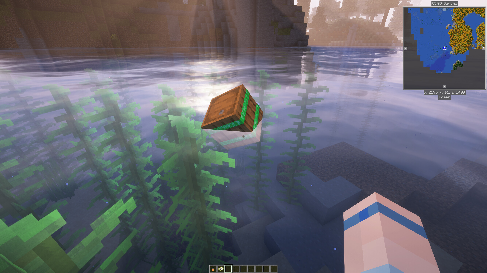

   I ran some tests, made a quick video of the animation then shared the code and video with the AI.  I explained the idea and that I needed some feedback on ideas for spawning rules around the barrels.  I was looking for how I could control random spawning to be near beaches or in rivers, then when the player interacted with the barrel and received a map, I would need to find a random point within some maximum radius for the treasure to be found.

** The Treasure Map

   The first thing the AI did was identify a bug in my code.  I had decided the barrels would be transient, they would not survive a server restart and they would have a time to live.  The narrative was after some time floating in the oceans, the barrels finally decay and sink.  As the server runs I do keep each spawned barrel recorded in a collection just so I can send each an update tick for their bobbing animation and to be able to delete them if needed.  This approach meant I didn't need to do much more than spawn a barrel and let it time out.  As I had learned in /SimpleShips/, I created the barrels with the primary *BlockDisplay* and an *Interaction*.  The bug the AI spotted immediately was in my time to live code, the way I was doing the life count down was using seconds but the life was in milliseconds.  Basically my barrels weren't sticking around for 5-15 minutes like I wanted, they were dying in seconds.

   After pointing this out, the AI then provided me with a snippet of code that would provide a simple check to see if a given X/Z position was considered to be coastal water.  It also responded to my comment about wanting to utilize the built in map capability by explaining about the different map support classes in Bukkit.  As before, the AI was reviewing multiple approaches and presenting different options.  It discussed the helpers for structured maps and recommended against using the vanilla buried treasure generation.  It recommended I use the *MapView* class directly and configure it with my own renderer and cursor.  It provided a few lines of code showing how to use the *MapView* and *MapMeta* API.

   In my initial comment to the AI about what I was trying to do, I had described how the Atlas system worked, and mentioned that the treasure marking beam only appeared when the player was within a certain distance and holding the map.   The AI laid out an approach that could work for that feature as well, describing a series of states that would occur.  I took in all of these suggestions and went and updated my basic prototype code.
   
   Using the suggested spawn approach, I re-implemented the code and barrels were now spawning only in bodies of water and within a reasonable distance to the shore.  I added a configuration to add a minimum distance between barrels and this worked. One addition I made to the spawning code was only spawn in a chunk that was already generated.  I didn't want the creation of barrels to cause the world to generate chunks. I then added the interaction event handler for when the player right-clicked the barrel, to locate a spot for the treasure and spawn a temporary marker and give the player a map. When searching for a location for the treasure, I chose to let the world generate chunks that I was checking.  I had put in a max radius from the barrel's location so I felt that these chunks being generated wouldn't cause an issue.
   
   My map though was blank.  The player's cursor was showing up on the edge, but the map was blank with no X to mark the spot and the map only filled in when the player got closer to the target.  This was effectively the vanilla treasure map model, but I wanted it to work differently.  I wanted the map pre-filled with an X like a proper pirate treasure map.  So I shared my updated code with the AI.  Again the AI offered multiple suggestions, add lore with clues, use the map like a vanilla one and fill in as player got closer, or use a custom *MapRenderer*. I went and started reading the docs on the *MapRenderer* and I explained my thoughts on going that route and drawing the X myself.
   
   The AI then proceeded to give me the basics of how the *MapRenderers* work, explaining details regarding the dimensions of the map, how to normalize the coordinates to draw the X.  It then made the suggestion that if the *MapCursor.Type* class offered a skull, that would be better to use.  Sadly it didn't, but that was the right idea and I did some more reading on the API docs and found that the *MapCanvas* had a /drawImage/ function that should allow me to do something custom. At this point the treasure map had become a component system unto itself, so I asked the AI to help structure all of the different snippets of code and existing Bukkit classes into a *TreasureMap* class.  With this scaffolding I set about getting the map to function and look like I wanted. I was able to resolve the remaining issues of having a target indicator using the built in red X and the player cursor properly working to guide the player, but the map was still empty and I wanted something different. We'd fixed the marker and the player cursor using the standard capabilities of the built in *MapRenderer* but I decided I would try my hand at doing a custom renderer instead.
   
   When I made that comment, the AI provided some simple pseudo code suggesting I convert the map's x/z pixel to a world block x/z location, sample the highest block or biome, if that was water use a water color, else use a land color.  The center of the map was the location of the treasure, and I had already allowed the chunk where the treasure was found to be generated, this would likely require a few more chunks to generate around the treasure's chunk so I could retrieve the block types, but if it worked out and allowed me to generate a map of the location before the player travelled to it, that was acceptable.  The AI explained the scaling model that maps used where a single pixel in the 128x128 map equated to 4 blocks or a 512x512 area.  It recommended I cache the results so I didn't need to sample 16k blocks each time the map was being viewed.  It even went so far as to suggest a color palette.  I did the development and the next test showed a map with blue water, green land and beige shore. I presented a snapshot image to the AI and wrote that I was going to adjust the colors to be more pirate treasure and add a little more details with using additional color to show some simple height variations in the terrain.
   
   The AI provided 2 parchment like color palettes to choose from, one it described as "more aged".  I updated and provided a screenshot that looked great.

#+CAPTION: Map with default features
#+ATTR_HTML: :width 256px :height 184px
#+ATTR_LATEX: :width 1in :height .75in
#+ATTR_ORG: :width 256px
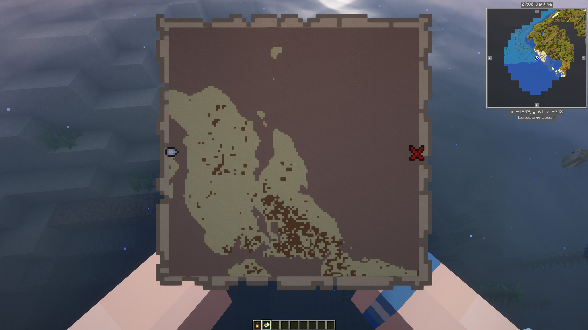

   I mentioned that I was going to replace the red X with a skull and crossbones image, and that I was going to do something simple and embed it directly into the code to avoid having to have a resource pack.  The AI quickly produced a nice simple 8x12 bit array that described a skull and crossbones.  All I had to do now was after drawing the map's pixels, simply use the bit map string to overlay new pixels and the map should show up now with a small skull marker.  Following this model, I created a slightly larger 16x16 image that I was happy with and used it as my marker. I asked the AI to provide the position mapping from real world location to map pixel location so I could draw the marker in the right place.  After getting all this to work, I now had what I felt was a wonderful result.  The map parchment style colors gave it an air of age, the skull and crossbone marker ended up being dead center of the map always, but that wasn't a bad thing.  The built in map navigation player cursor worked exactly as it was supposed to.  I had a real pirate treasure map.

#+CAPTION: Map using a custom marker
#+ATTR_HTML: :width 256px :height 184px
#+ATTR_LATEX: :width 1in :height .75in
#+ATTR_ORG: :width 256px
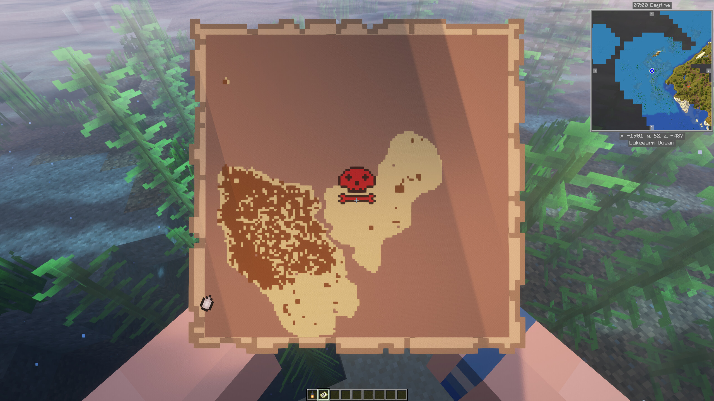

  
   On testing I ran into a small issue.  I discovered that if I had a pirate map in an inventory or on my bar and restarted the server, it was replaced by an empty vanilla map.  All my rendering was gone.  Understandably the custom renderer I had created was not being persisted across restarts. I needed to fix that problem, but how?  Well, the solution turned out to be the *PersistentDataContainer* capability that existed.  What I determined I needed to do was  capture all of the details I needed to restore the map as persistent data attributes on the map, then the AI provides a /repair function/ and a couple of event hooks to call it from.  The /repair function/ would be called for every item in the player's inventory or any item the player was interacting with.  If the item was a *Material.FILLED_MAP* and the map was tagged as one of mine, then I'd extract the stored information and rebuild the map's custom renderer.  This was wired up and appeared to work as expected.

** The Treasure Chest 

   I was now starting to work on the visuals for the treasure chest and the treasure marker.  I started with the treasure chest, and a simple *BlockDisplay* using the *Material.COMPOSTER* as the base, scaled to make it wider but thinner.  I thought the texture of the *Composter* looked good as a treasure chest.  I knew that my final chest and treasure markers would consist of more than one or two display items, so I put together the first pass at a  *CompositeDisplay* class to manage multiple connected displays.  I used the same approach as from /SimpleShips/, I added a command to the plugin that would allow me to spawn in a treasure chest.  I would set the location for the spawn as one block away from the player.  The *CompositeDisplay* was defined where I could add any number of display blocks, along with vectors for translation, rotation and scaling.  When I spawned in my first treasure chest, it looked right but was positioned wrong, it was tilted even though I hadn't provided any rotation values.

#+CAPTION: First treasure chest spawn
#+ATTR_HTML: :width 256px :height 184px
#+ATTR_LATEX: :width 1in :height .75in
#+ATTR_ORG: :width 256px
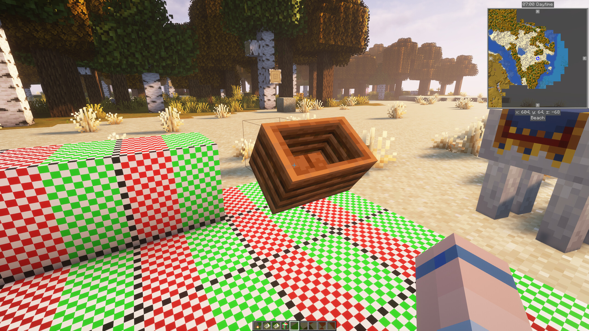

   I was back to orientation problems, so I showed the AI my code and my image where it immediately pointed out that when I had cloned the player's *Location*  and then added the x/z offset to move the location, the chest's *Location* still carried the /pitch/ and /yaw/ values that player had.  I needed to zero those out.  I had actually thought about that in my original testing, having zeroed out the /yaw/ as I had remembered dealing with that in /SimpleShips/, completely forgot there was also a /pitch/ value.

   As I was testing I ran into a new issue with the treasure map.  I noticed that sometimes when I looked at the map it was blank, then after a few minutes it filled in.  The server logs were showing watchdog thread timer errors.  I determined the errors were happening during the loop to find the highest blocks to get the right color for the pixels on the map.  The AI supported my conclusions and suggested the problem was because I was building the entire map inside the render function in one pass.  It suggested I should generate the pixels in a background process and in the /render/ method only paint the map when the pixels were all calculated. Its design was to break the generation up by chunk, first determine the chunks in the map, then use each snapshot outside the main thread.  It pointed out that there was a *ChunkSnapshot* for use in thread safe processing and created a complete function that would return a *CompletableFuture<TreasureMapImage>* object which it described as the "correct direction".

   But then the AI offered up a simpler approach, do the processing in sections over ticks.  Basically each tick, do a certain number of rows of pixels, keeping track of the ones completed.  While the use of *CompletableFuture* may have been the textbook approach, I implemented the simpler approach of a block of rows per tick.  In the end, I stuck with that approach, with a couple of minor tweaks, and that is what is in the code now.  This eliminated the watchdog errors in the logs, though the map would still read initially as blank then pop in.

   Getting back to the treasure chest, now that the positioning was working as expected, I went to the [[https://bdengine.app/][BDEngine]] app to create a nice looking chest.

#+CAPTION: First custom chest designed with BDEngine
#+ATTR_HTML: :width 256px :height 184px
#+ATTR_LATEX: :width 1in :height .75in
#+ATTR_ORG: :width 256px
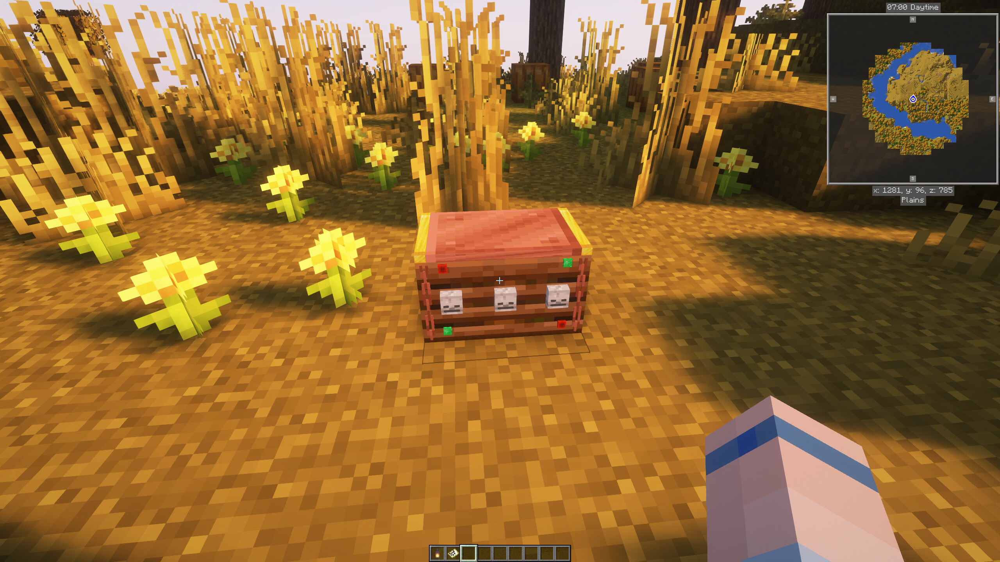

   After playing around with a number of designs, I came up with a composite that consisted of 11 *BlockDisplay* entities and 7 *ItemDisplay* entities.  I enhanced my *CompositeDisplay* class to include adding *ItemDisplay* parts and figured out how to map the BDEngine generated summon command to the needed calls for adding block and item display items in a *CompositeDisplay*.  I also added functions to support adding data to the persistent data cache of every display entity in the composition and moved the class into a /builder model/ where I could control the timing of the display part spawning.  At this point I also decided that there would always be an *Interaction* entity as the /anchor/, all the display entities would be tied to that. My *TreasureChest* class was now a holder of a *CompositeDisplay* that it created on construction.  It made sure the *CompositeDisplay* had the needed persistent data such as the map's identifier.

** Barrels and Maps Revisited

   With the core components now working, I still needed to construct the treasure marker. Another round of working with BDEngine and converting that into a *CompositeDisplay* and I had a nice looking marker.

#+CAPTION: Treasure marker
#+ATTR_HTML: :width 256px :height 184px
#+ATTR_LATEX: :width 1in :height .75in
#+ATTR_ORG: :width 256px
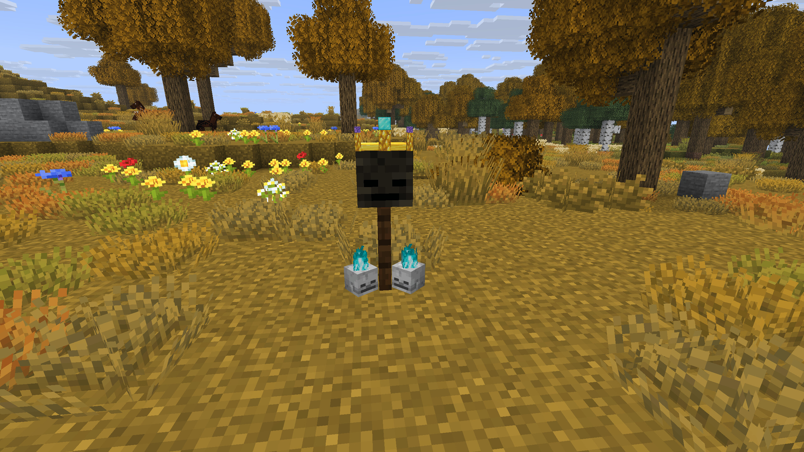

   I had always had the thought that I wanted different tiers of treasure and decided to revisit that. I discussed with the AI that I wanted to add some type of color accent to the barrels to identify the tier, and that I would carry that accent into the map by coloring the skull marker.  I was thinking along the lines of particles but the AI recommended against that.  It explained that particles had to be manually managed and they might feel more flashy than I was going for.  It recommended I try adding some accents to the display, with ideas like colored bands, gems, chains or tiny accent markers.  That got me thinking of possibilities.

   While I was working out the tier effects, I reworked the map rendering.  Using the simplified model of rendering in rows had removed the timeouts, but I still didn't like the blank/filled transition.  So I updated the rendering to paint the rows that had been built.  This had the effect of the map /filling in/ from top to bottom.  I also realized that the map had to rebuild after every restart and so I thought perhaps I could persist the pixels.  The map was built up as a 16k array of integers and the *PersistentDataContainer* supported storing integer arrays, so it seemed reasonable to simply store them to the map's PDC and they'd be available on reload.  I tried it, it didn't work, the pixels weren't stored and retrieved.  So I shared these changes with the AI and it immediately identified that my code was effectively using 2 different meta objects, one for the renderer and the other for the map item.  I needed to be saving the pixels to the map item meta and wasn't.

   The AI then pointed out that a 16k array of integers would be stored as 64k bytes, a lot of overhead particularly if there were many maps in a given chunk.  It then suggested to use the indexed palette model, where the value I stored was a single byte value 0 - 2 since I only used 3 colors - water, low land, high land - and later the index 3 could be for any other accents I might use.  Then if I persisted that I'd only be saving 16k.  After this suggestion, however, it said the /better/ option was to store the data in an external file in the plugin's config directory.  As with /SimpleShips/, this was something I wanted to avoid if possible.  I opted instead to create a packed pixel model where I used the indexed palette approach and 2 bits per color.  I created a simple *PixelPacker* class to compress and expand the pixel array and was able to reduce the data in the PDC to 4k.  That seemed perfectly acceptable to me and is the approach I went with.  I was now persisting the generated map and on server restart was able to immediately restore it.

   I now wanted the map to do even more, I wanted it to do a /reveal/, basically instead of being blank and then filling it in, I wanted it to appear to be water logged and the water slipping off the page.  I created an image with Gimp as an overlay that didn't turn out quite right.  It also had the issue of needing to have a separate image file.  I showed the AI what I was wanting to do and how it was turning out and it suggested that I didn't need such a noisy image, but could instead use colors similar to the map's palette and do the water-logging procedurally and not with an image.   It provided some code snippets using a pseudo-noise function to generate a splotchy looking image.  It added some /sheen/ effects, and after I implemented this code and tested, it ended up with a diagonally striped pattern that didn't match my vision.  The AI agreed the first suggested approach didn't work out, so it produced a different suggestion that would use the base parchment color and just generate some blob-like stains.  This worked out very well, so now my maps would start up filling the image with a soaked, blob-stained image that was quick-generated and didn't rely on reading blocks.  Then as the map updated, the upper rows would start filling in making it look almost as if the water was slipping off the bottom.  The effect was perfect.

#+CAPTION: Water draining and revealing the map
#+ATTR_HTML: :width 256px :height 184px
#+ATTR_LATEX: :width 1in :height .75in
#+ATTR_ORG: :width 256px
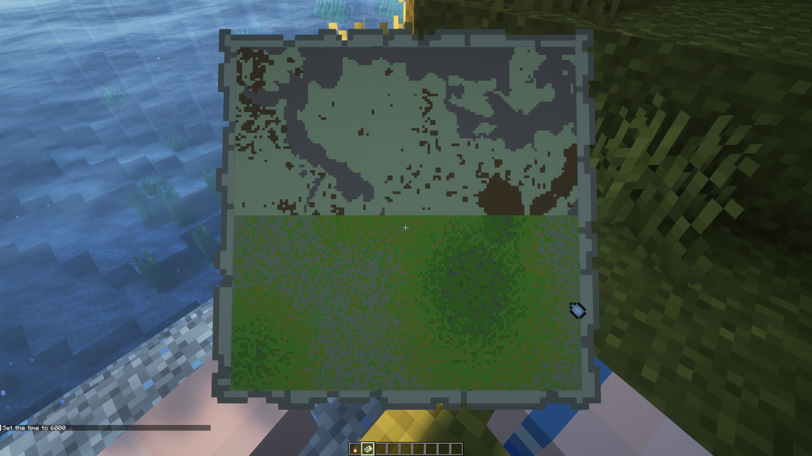

** On To The Marker

   I next presented the AI with my idea about the treasure marker.  Here again I had used BDEngine to create a model that I liked, now I needed to put it to use.  My thought was once the player had the map and travelled to the location, when the player came within a certain distance, the treasure marker would appear.  I wanted to be sure the marker only spawned once, and I only wanted it to happen if the treasure map was on the player's item bar. I expected that would require constant polling of the player's inventory to see if there was a map, then checking if the player was near the map's treasure location.

   I told the AI I didn't want that to bog the system down. I also mentioned I didn't want to add any more data management to the map and thought I needed to handle these details in a new class.  The AI promptly produced a whole series of new code with a new manager class and various game states.  It provided a scanning model that was server friendly, and recommended refactoring the *TreasureMap* to extract all of the pertinent attributes for the treasure - location, status of the marker, etc - into a record that could be used easily.  It listed out potential game states for the marker such as guardians spawn, marker removed, chest appears.  I reviewed all of this and though it was a good design, I decided to go with something a bit simpler.
   
   First, I indicated I was going to go back and let the map handle the basic state of the marker being revealed, and that once revealed the marker would remain and not disappear if the player moved out of range as I originally planned. I knew this could result in a different player finding the marker but I thought it was better than placing/removing the marker.  The AI pushed back on me using the map to manage the marker.  It pointed out that I now had two persistent objects with independent lifecycles that I'd need to keep in sync. It recommended creation of a treasure record that would be managed by the plugin once the map was accessed and the map only identifies the treasure then is basically done.  Here, again, the AI was suggesting storing this treasure record in the config directory of the plugin.
   
   After looking over the suggested approach, I did a bit more thinking and came up with a different model that I presented back. I defined the flow to be

#+ATTR_HTML: :width 90%
#+ATTR_LATEX: :width 4in :height 1in
#+ATTR_ORG: :width 1024px
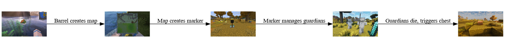

   cycle is done.  I specifically indicated that state would be held in each component, not in a central record. After each step, things would clean themselves up.  After accessing the barrel, it is removed.  I then decided to spawn the treasure location the moment the map was used and not do the spawn when the map came close to the spot.  That both simplified the code and basically ended the map's use immediately.

   Interacting with the treasure marker triggered the guardians, the marker itself recorded the unique ID of each spawned guardian and hooked the entity death event to track when the last guardian was vanquished.  Then the marker triggered the chest reveal.

   The AI recognized that immediately as a typical chain of responsibility model. Each component had a connecting thread, they each knew the map ID and each component was able to persist its own data directly in the PDC without any external files.  The AI still suggested I create a registry to track any components I created.

** Refactor Time

   At this point my code was a mess again and needed a refactor which is exactly what I did.  In reworking the barrel I moved it over to also be a *CompositeDisplay* and worked out a mechanism for doing levels, I settled on 3 tiers - Blue (Lapis), Green (Emerald) and Red (Redstone).  In the composite for the barrels I created and sized two blocks of the level material and positioned them such that they overlaid the default bands the barrel texture has.  Then on spawn I assigned a level to the barrel, it generated now with the colored bands.  I included the level data into the barrel's PDC so that when I created the treasure map I could carry the level to the map. The map was then updated to render the skull and crossbones in the appropriate color.
 
   The one thing I wasn't happy with was that the bands on the barrels just didn't really stand out and at night you couldn't see them at all. I tried different approaches then asked the AI for some thoughts and it pointed out that display entities had the option for a brightness value.  I had not come across that, but knew immediately that was the approach.  I added the brightness values and the redstone and emerald bands on the barrels, and gems on the marker and chest lit up nicely.  The lapis, however, turned more white than blue.  The Minecraft rendering was just making it go that direction, so instead of fighting it I swapped out the levels.  Emerald became level 1, Redstone level 2 and Diamond level 3.  Diamond bands took the brightness nicely.

#+CAPTION: Barrel tiers  
#+ATTR_HTML: :width 768px :height 184px
#+ATTR_LATEX: :width 1in :height .75in
#+ATTR_ORG: :width 256px
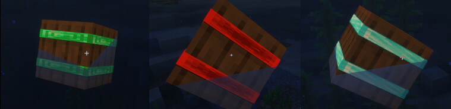

   I was thrilled with the outcome.  I shared the updated barrel, map, marker and chest images with the AI and it made a key suggestion - why not carry the gems into the treasure marker and chest composites as well.  I hadn't even thought of that but I did it.  On the treasure marker, I incorporated a small "gem" made of the level block onto the crown and added a similar gem block to the top of the treasure chest.  The *CompositeDisplay* made this all very easy to change out.  I now had a visual thread through each component that tied them all together.  I was impressed that the AI picked up on what was purely a visual aesthetic.

   I was into heavy testing at this point, things were looking good, the cycle was working.  In my testing I had a treasure marker spawn atop a villager house.  While I thought that was cool to see, obviously there could not be any buried treasure there. The AI suggested a similar /allowed blocks/ approach that I used with /SimpleShips/, just check to ensure the spawn location was one of a list of natural blocks.  Simple update and that worked.

** Treasure Chest Challenge and Loot

   Now it was time to get the guardian spawns and generated loot right based on the tier level.  The AI recommended a number and level of guardians that should be challenging but not frustrating for the player, maxing at 4 for diamond level.  I did some work on the spawning and had some questions that the AI was able to provide quick snippets of code to generate the skeletons as I wanted them based on their levels.  We captured the unique ID for each skeleton entity and I stored those in the PDC of the treasure marker.  I added in the death event hooks and as each skeleton died, I removed its ID from the PDC data.  Once all skeletons were dead, the marker triggered the chest reveal.

   To get all this to work right, I had to enhance the *CompositeDisplay* with the ability to reconstitute from an *Interaction*.  Basically, whenever an *Interaction* was available, either from an event or when scanning for entities, it would be checked to see if it was part of a *CompositeDisplay* and if so, find all connected entities and rebuild the object.  By standardizing on this approach I no longer needed to record the presence of any of my objects, they could exist in the world and when interacted with, become whole again.  This worked out so well I carried it back over the /SimpleShips/ plugin where I enhanced it to be able to also have an *ArmorStand* included with appropriate mount/dismount capability.  In /SimpleShips/, I reworked  the passenger seat, entity pad and parrot perch to use this new approach and I've not had any further issues with these objects getting out of synch on server restarts.

   Everything was working as I had envisioned, the AI gave me direction for setting up the loot tables and for defining a structure in the configuration file to allow admins to add custom loot options using a weighted random model.  I added some animation in the plugin, on defeating the guardians the treasure marker would slowly sink into the ground, followed by the chest rising up.  I was happy to discover that I could create *BlockDisplays* of blocks like *Material.SOUL_FIRE* and that it would animate automatically, giving nice effects to my custom objects.

** The Lessons Learned

   In looking back over what has been built, I can see that my collaboration with the AI was able to rapidly accelerate the work in two main areas.  First, as I started out, I was using the AI to help me navigate an unknown toolkit, one with many years and many layers.  When I was able to properly frame my questions, the AI could zero in on a solution.  When I wasn't totally certain what to do, the AI would provide multiple options that I then had to explore.

   The second area was design exploration.  Not only was the AI able to evaluate multiple possible approaches in mere moments, but it also worked as almost a whiteboard design partner.  Many interactions were back and forth conversations where I'd pose a "what about this", and the AI would evaluate the implications, alternatives, and tradeoffs.  It was the same model I had used for years with architects and senior developers: whiteboard the options, review them, discard some, keep others.  There were times when the AI favored approaches that solved the problem but introduced complexity I did not want, such as when it repeatedly considered solutions that would have required external data storage.  But then there were times I was going off the rails, such as trying to get crazy fancy with having the treasure marker only appear when the player was nearby.

   By the time I had published the first release of /Dead Man's Chest/, I had a solid understanding of the core PaperMC plugin model, had seen how composite displays could create convinving new objects, and had built a reusable architectural layer around classes such as *CompositeDisplay*.  I had also proven to myself that carefully designed primitive fields in a *PersistentDataContainer* could support surprisingly rich object structures, much like relational databases do.

   So in /SimpleShips/, the AI operated as researcher and teacher (and matrix math expert) while I built out the code.  In /Dead Man's Chest/ the AI worked as a sounding board and design partner while I did the development of the models and continual refactoring of both the design and the code.

   In my third plugin that I'm working on, /Ramps and Wedges/, the AI does all of the heavy lifting following my requests.

* Ramps and Wedges  
** The Idea

   The third project in this trilogy was something a little different, not directly related to the /SimpleShips/ or /Dead Man's Chest/ but usable with them.  In many other games I had played that had building as a key factor, the building parts often consisted of blocks, walls, floors, ceilings and other parts.  In almost all of these other games, the building palette also contained triangular pieces and custom roof pieces.  Being able to /round out/ builds with triangles looks good to me.  In modded Minecraft play, I regularly include mods that add roofing systems so that I can have something other than stair and slab roofs.

   I started out this exercise by literally posing an "is this possible" question.  I'm copying that original interaction with ChatGPT verbatim (typos and all) here because I think it provides good insight into how I had come to work with the AI in my development.
   
   /Have just an "is this possible" question. With latest releases of Minecraft and datapacks it is sort of possible to have custom models through a custom resource pack is required to describe those models. Assuming that isn't an issue, would there be a way to define basically 8 new block models that are "triangles"? What I mean is, could you define new models that are basically cut the block along the two diagonals so you have wedges with the point in each of the 4 corners, and do this across horizontal and vertical diagonals leading to 8 basic simple models? Then every block could provide these 8 new block shapes with standard textures thus give ability to do smooth curves in builds and ramp designs? Cherry on top would be if the ramp types could be treated like stairs for movement purposes smoothly. I've been using triangle pieces in other building games and they work quite well. I only rarely place two triangle pieces together to form a square of different materials so I think it would be find if combining 2 triangles in one space required it operate like two slabs -same material, becomes a standard block. Is this something doable?/
   
   The AI was again ready with the answer, "Yes - visually, absolutely; physically, mostly; as true new block types, not quite".  This is the type of answer to "can this be done" questions I had become accustomed to when working with other developers and architects.  The AI went on to describe the details about the Java resource-pack model system, something I was already familiar with having gone down that path originally with the /SimpleShips/ helm that I eventually abandoned because I didn't want to require resource packs.  Here, though, I knew this was going to be the requirement and was ready to fully embrace the capabilities.
   
   The AI walked through the overall concept, where it described how I would need to create the new models, map them to /carrier blocks/ or use the *BlockDisplay* approach.  It also mentioned that we could utilize existing Minecraft textures, thus avoiding needing to create new ones.  It then pointed out the main /wrinkle/ would be in collision handling because the resource pack doesn't offer a way to define new collision boxes.  For triangles, as my collaborator pointed out, they could look good but would have a full box collision if we went the carrier approach.  If we went the *BlockDisplay* approach, we would have to define our own hit box.
   
   For the ramps, though, it suggested what it described as a /very promising cheat/, that was to use a vanilla stair block as the underlying physical carrier block but make it look smooth.  This would then use standard Minecraft stair collision handling.
   
   Lastly it explained that we didn't need to create all 8 of these new models for every block, we just needed to make 8 generic geometries and generate material-specific model JSON files that reference normal block textures.  The AI proposed a build-time generator to create what was needed.  The AI's final analysis, here again verbatim,
   
   /So I would rate it:/

   /Custom visual wedges: easy-to-moderate./
   /Hundreds of materials via generation: quite feasible./
   /Placement/breaking/rotation: moderate plugin work./
   /Smooth ramp movement: feasible by borrowing stair collision./
   /True triangular collision: the hard/impractical part./

   /As a building system, though? Very doable. You could get 90% of what makes triangle pieces useful in games like Palworld without needing Minecraft itself to support arbitrary voxel collision geometry./

   After reviewing the feedback I chose to not worry about the collision issues, as the intent for this project was really more for aesthetics, so we wouldn't go with the *BlockDisplay* approach. I wondered if we might be able to get a /better/ collision option if we used as the carrier a block that wasn't a full block and had smaller hit box, such as a wall that has a hitbox of 0.5 x 0.5 or even the dragon egg which is 0.875 x 0.875.  The AI said it was something to consider but it pointed out that if we used something like a wall piece, we'd need to consider path finding because it might visually look like a wedge, but mobs would see it as a wall.  At this point I asked if it was possible to build a prototype in a datapack to test out the idea and asked the AI to generate that datapack.

** The Prototypes

   1 minute and 4 seconds later, a datapack was ready for download.  I downloaded the pack, dropped it into a test game and had triangle wedges and ramps.  I noticed some rendering artifacts which I immediately recognized as Minecraft render optimizations.  The block that I would place a wedge on considered the wedge to be a full solid block so the connecting faces were being culled by the renderer for performance reasons.  This resulted in the exposed part of the connected block having no texture giving me an x-ray view into the ground.

   We moved on next to getting the rotated versions of the new shapes so that I could test wedges and ramps in any direction.  Version 2 of the datapack was available 1 minute later.  Still had face culling issues, but this was proving out that the idea would work.  I did notice that when normal stairs were placed next to a ramp at an angle, the normal stair connecting shape changes would occur on the normal stair but the ramp remained as it was.  Under the covers, the carrier stair block was being reshaped but it wasn't visible, the ramp model was.  At this point the AI suggested instead of trying to get creative with model geometry to solve the wedge face culling issues, I look into different carrier blocks.  I made the suggestion to try using glass blocks which, because they are transparent can't have the faces of connecting blocks culled.
   
   V3 was generated, vertical ramps were still using the *Material.STONE_STAIRS* as the carrier but now we used 4 different glass blocks for each of the wedge directions, white for north west pointing, orange for north east, magenta for south east and light blue for south west.   Upon placing the wedges, success.  The connected block didn't face cull and fully rendered the connected side.  The wedge now looked like I wanted it to look.

#+CAPTION: First stone ramps and wedges
#+ATTR_HTML: :width 256px :height 184px
#+ATTR_LATEX: :width 1in :height .75in
#+ATTR_ORG: :width 256px
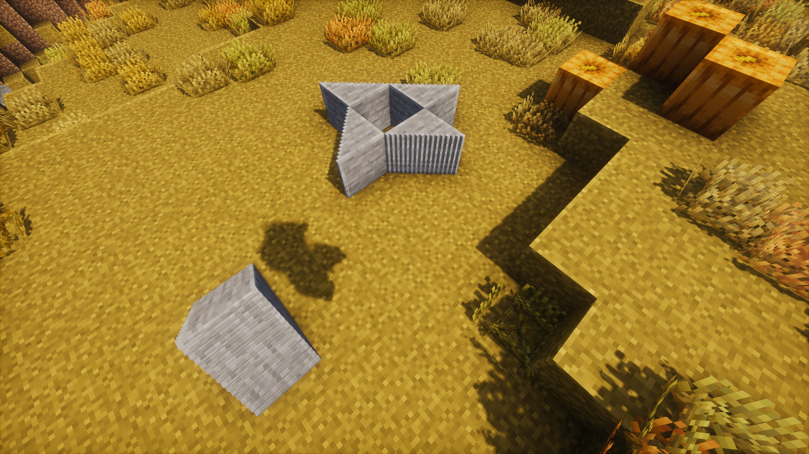

** A Different Working Model

   One key difference when working on this project with the AI over the other two is that everything was visual.  I basically created a screen snap of each trial and uploaded the image for review and the AI properly /read/ the image.  An example of that was our first attempts were showing a distinct line edge artifact.  I made an image of what I was seeing and handed it over and the AI described that the new models for the ramp were made up of 16 thin elements, with each having its own textured face and then stated it could be smoothed out but likely couldn't be perfect.  Again I was amazed at the ability to recognize and analyze a purely visual situation.

   I asked the AI to create another snapshot using walls as the carrier, walls didn't work, they didn't inherit the new model, likely because the engine has special handling for fence and wall types, so we went back to using the glass blocks.  We now had a direction, stairs to carry the ramp shapes, glass blocks to carry the wedges.  V5 was focused on trying to clean up the seams and little texturing artifacts.  The AI attempted a rotated cover-plate experiment that ended up creating offshoot panels, this wasn't going to work.  It recommended experimenting with UV mapping instead so I asked for a V6 to try that.

   I had another idea I posed, what would happen if instead of creating the models by building up progressively smaller textured layers, we instead /removed/ layers by starting with a full block and hiding layers with a transparent texture.  The AI said it wasn't a crazy idea, it was standard constructive solid geometry, a topic I was familiar with from having played with shader generated scenes, but that it wouldn't work with the Minecraft engine because even though a transparent texture could make pixels on a face transparent, it wouldn't hide the geometry behind the face.

   After explaining that, the AI did offer up two new suggestions.  One was to try building up the wedge from full cuboids but only defining the faces that should be visible.  The second approach was something new to version 26.1, where there was now support for /cutout textures/ on any block model. It should be possible to create an alpha mask to smooth the sides out.  The AI specifically stated

   /So your subtraction idea does not work literally, but it points toward a potentially better V7/

   And this one simple comment solidified in my mind how I see the future of AI usage, not as a replacement, not as a simple robot doing only what it is directed to do, but as a collaborator and sounding board.  I would come up with ideas, the AI would present options and feasibility.  Its response would cause me to start reviewing other options, and my response elicited the same reaction in it.  

   There’s a phenomenon called constructive interference where, for example, ripples in a pond build on each other and become stronger. The same thing can happen in working groups where people with different experience and skills build on one another’s ideas. That was increasingly how this collaboration felt. I would throw out a “what if,” the AI would rapidly evaluate it, and its answer would trigger another idea in me. The speed at which the AI could explore possibilities, combined with my own experience deciding which possibilities were worth pursuing, became one of the most valuable parts of the process.

   We worked through 10 full iterations of the idea until we had a working prototype datapack.  We agreed to some concessions, such as having 8 distinct blocks instead of trying to get fancy and /deduce/ the rotations. We now had a working proof of concept for my initial idea.

** The Plugin

   At this point we switched the project over from a datapack to a plugin where the focus would now be on quantity.  Could we get more and more block types into this model?  The first iteration of what became the *ResourcePackGenerator* registered a handful of wood types.  After the prototyping I had suggested that the blocks would be crafted in the stonecutter instead of trying to produce multiple recipes for the crafting table.  This was an approach I had seen used by other plugins and it just fit for me.  So that is the direction we took.

#+CAPTION: All shapes available in the stone cutter
#+ATTR_HTML: :width 256px :height 256px
#+ATTR_LATEX: :width 1in :height 1in
#+ATTR_ORG: :width 256px
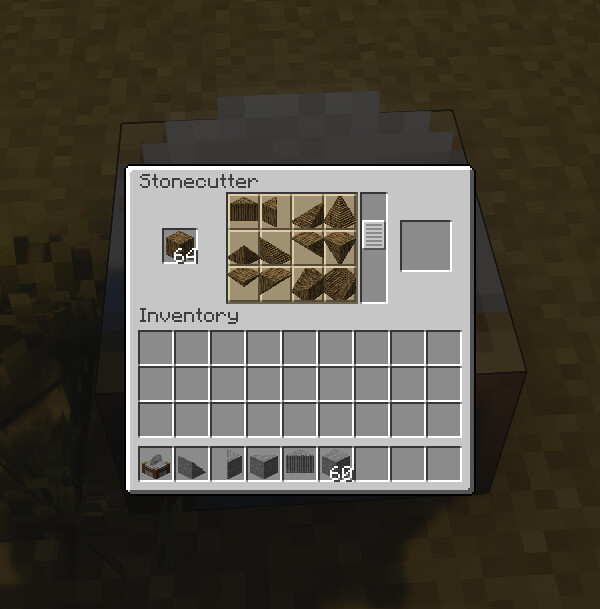

   I had put the basic plugin skeleton code together following the pattern of my other two plugins, but I asked the AI to take the lead on generating the code for this one.  We had a clear vision of what needed doing, I felt this project could be run like any standard project. I would define the tasks and the development pod would implement them.  ChatGPT was now my development pod and it was quite efficient at it.  It followed my programming style that it had picked up from when it had performed code reviews and analyzed the code from my other plugins, so now I was doing the code reviews with no issues and also handling the QA tasks.

   As the code was implemented I was building and testing exactly as I would have with members of a development pod.  As I hit little issues, such as noticing that after placing a wedge or ramp, upon picking it back up I what I got was the original plank material, not the wedge or ramp, I'd submit my bug reports and the AI would go

   /right, that's because we didn't handle the break event/

   and submit an update to the code.

   Over my career I have lead teams that were geographically dispersed, often with core team members in the same office and able to interact directly.  In recent years, however,  I have been working remote jobs where we might only physically come together a couple of times a year.  In this world, our activities and collaborations are generally through ticketing tools like Jira, chat and some video conferencing.  The bulk of development, requirements and bug discussion, though, take place in chat and ticket comments.  What I realized is that what I was doing with ChatGPT via the web interface was exactly the same and producing similar, albeit much more rapid, results and updates.

   We continued this way adding capability, but we had built this system similar to how the early incarnations of the /SimpleShips/ and /Dead Man's Chest/ worked - we were tracking these placed components inside of the plugin in collections so that when a given block was broken, the plugin knew what it was supposed to be to give the player the correct dropped item.  As I had done previously, I decided this was too fragile a model because server restarts effectively lost track of the details.  But we were effectively working with true blocks this time, not entities, so I asked the AI if there was a way we could follow the model of the other plugins, attach data directly to the block itself.

** Tracking The Block Types

   The AI suggested that blocks had a metadata option we could use, but this information wasn't persisted, so we'd still lose the information across restarts. There was another option the AI offered up, that we consider storing the details in the persistent data contents of the chunk itself.  So we wired that up and it seemed to work and we continued with the development.  As I had started a new context thread after the datapack prototypes, I pulled over the version 10 datapack and made that code available to the AI in the new context. The AI then took the model details we had worked out in the prototype and turned them into templates.

   The next iteration brought in additional types - stone, cobblestone, stone_bricks, oak, spruce and birch.  The AI produced code to generate all of the models needed but then we hit a problem.  For the ramps, we were set up to use the existing stair block for each type, which of course meant we would only be able to have ramps of block types with existing stairs.  We did multiple code updates to get the different pieces working and it got to the point where so many different changes had been introduced, we were starting to lose coherency in the codebase.  So I packaged the existing source code into a zip file and provided it to the AI so we could level set.  The AI did a cleanup of the source re-centering it and I took the updates and merged them into the working codebase.

** Limitations

   With this update we got everything working as expected so I raised the bar - how do we get this to work with any desired block types?  The current model had a serious limitation that I had seen but not yet looked into.  Up until this point, for any ramps we wanted, the block type required that it had a stair that we could use.  The wedges required 4 transparent/translucent blocks as the carriers.  What was happening was for blocks where we could have ramps, we were giving up the original stair, and we were consuming all of the glass blocks. This was not a scalable solution so I asked if it was possible to change things around.  Instead of replacing the model of the actual block with the new model, could we instead have different item models?  I had the idea from the fact that when I had one of these new /blocks/ in my inventory, it was just an *ItemStack* with a custom model texture, couldn't we do something similar with blocks?

   The AI agreed that the current approach wouldn't scale, but that we might be able to use the inventory item model idea.  The AI then pulled out the pattern that we had used in /SimpleShips/ and /Dead Man's Chest/ and suggested that what we could do was use a single carrier block for the ramp, and 4 carrier blocks for the wedges, but when rendering we would render an *ItemDisplay* that was using our new models, the same models that were allowing the items to look correct as inventory items.  The only issue now would be that both the new *ItemDisplay* and the carrier would render because the carrier physical block was still present.  To resolve that, the carrier was given a completely transparent texture.  For ramps there still had to be a physical stair block and for the wedges we still needed physically transparent blocks, so that meant losing some blocks.  For my usage, I chose to sacrifice the red sandstone stair as I rarely used that, but I did make that configurable.

   We prototyped this approach for ramps, one sacrificed physical stair block and multiple different block types as ramps and it worked.  The AI now brought up a possible concern, what this new model was doing was creating a new entity for every ramp we created and that we shouldn't assume that just because the *Display* entities didn't receive update ticks, that they were performance free.  This is where load testing needed to occur and though I did some testing and built various structures with many ramps, I wasn't stressing it enough to prove the point one way or the other.  I decided we'd continue with this model and just see how it turned out over time and monitor performance, exactly as I would do with any other system.

   This new approach led toward a nice simplification of much of the code, with the workhorse being the *ResourcePackGenerator*.  We continued updating and prototyping with the ramps and were able to show that I could now create ramps of block material that didn't normally have stairs but allowed navigation just like normal stairs.  I only lost the ability to use standard red sandstone stairs.

   The *ResourcePackGenerator* had previously been producing a model file per new shape per block type, but with the new approach, it only needed to create a single model file per shape that would be reused with different textures. More testing showed that I could create ramps using materials like oak planks and cobblestones and still place oak stairs and cobblestone stairs directly. We updated the config file to now allow the admins to decide what block types would be allowed to have ramps and wedges, and updated the *ResourcePackGenerator* to use that list to produce the pack.  The AI then provided another whole series of suggested changes to much of the codebase as a series of code snippets.  Here again I had to upload a full copy of the existing source code to level set. The AI cleaned the source up and gave me a full download which I again merged into the codebase.  We were into full QA at this point with ramps, working out solutions to various issues like wrong rotations when being placed.

   Starting and stopping of the server was now showing a different issue, the placed ramps were no longer visible but an invisible stair was present. I resolved this one by changing our *ItemDisplays* to be persistent.  I also gave each *ItemDisplay* an ID constructed from the location of the physically placed block so that when the block was broken I could locate the correct *ItemDisplay* and remove it as well.  I generated the ID string as

#+BEGIN_EXAMPLE  
   "ramp_" + block.getX() + "_" + block.getY() + "_" + block.getZ()
#+END_EXAMPLE

   and stored it in the *ItemDisplay* PDC.

   We continued refactoring the code, removing unneeded pieces and fixing the errors, to the point where I had to again upload the full source code and simply asked the AI to clean it all up.  With the code cleaned up I merged that into the baseline.

   One point I'd like to make here, these frequent level-settings were not an annoyance to me.  In my career I have had the pleasure of working with brilliant developers and architects.  These individuals often worked in a way that felt familiar here: give them a problem and they could produce a working approach very quickly.  The code wasn't always well structured and often multiple iterations were visible, but it would work.  I would then have to work with them and the code to clean it up into a maintainable structure, only to have the next requirement result in reworks, dead code and more cleanup needed.  The key takeaway from those situations was that at the end of the day the code couldn't just work, it also had to be supportable and maintainable, and if I had trouble following it, then I expected others would as well. That's how I thought about this interaction.

** Testing and Polish

   More QA, more polish on the ramps, little things like removing the red sandstone stair recipe from being craftable since it would be invisible if used.  Now I was starting to think about the wedges.  We had to sacrifice only one stair block for all ramp types, but I currently needed four carriers for the wedges and was losing four of the glass blocks per block type. I posed the question, could we use the same approach for wedges we were using for ramps, one set of carriers for all types.  My collaborator indicated that should work fine.  I then asked, could we use a single carrier block and not 4, and would it work if we used the naturally invisible *Barrier* block?  The AI thought that was an interesting idea, explained why it should work, then it  pointed out that there was a wrinkle. Normally *Barrier* blocks are not breakable in survival, and so our *BlockBreakEvent* might not fire.  We tested using the *Barrier* blocks as the carrier and it being a naturally invisible block, it didn't trigger face culling and didn't trigger the *BlockBreakEvent*.

   I noticed that when I held an actual *Barrier* block in my hand, that caused any placed ones to show a texture of a red circle with a slash.  That's how that block normally works, but it looked odd on my wedges.

#+CAPTION: Barrier Block texture showing thru
#+ATTR_HTML: :width 256px :height 256px
#+ATTR_LATEX: :width 1in :height 1in
#+ATTR_ORG: :width 256px
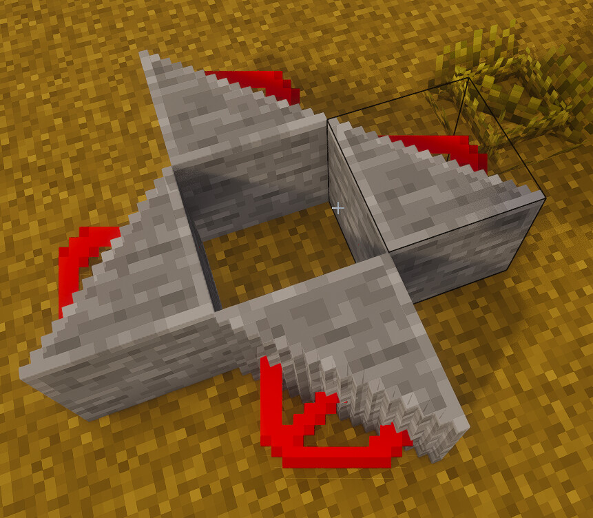

   The AI pointed out that if we used an actual barrier block in the item stack in inventory, that feature would trigger when holding a wedge, so the inventory *ItemStack* items were actually given the original *Material* of the block, but with the updated model.  The AI implemented a handler for the *BlockDamageEvent* to detect when trying to harvest a *Barrier* block wedge so that it could break.  It all worked.  Wedges placed without face culling issues, they had a full block collision box, harvesting them worked and the correct *ItemStack* was dropped.  We now had a full working model for any ramp types and any wedge types costing only a single placeable block, the red sandstone stair, and a block not normally available in survival, the barrier block.  And ramps and wedges were available for any block type I wanted to try.

** More Blocks

   I now requested *ResourcePackGenerator* be updated to produce needed item files for ramps and wedges for all block types.  The AI updated the code to generate the files and specify the default textures to use based on the block type.  This worked for most all of the blocks where the code assumed the texture name matched the block name.  We did run into a few cases where a block used more than one texture for all faces and where the texture name was not the same as the block name.  Another rework of the codebase and I started testing.

   For the blocks I tried they worked as expected, I now had another polish change identified.  When harvesting the blocks, they all harvested at the same speed which was a bit jarring.  Oak ramps would take just as long to harvest as stone ramps and longer than oak stairs because the real block was a red sandstone stair.  All wedges harvested at the same speed because we had one routine handling breaking the barrier block.  And harvesting particle effects didn't match the real blocks.

   We didn't make any changes on these issues as I wanted more testing, so I took the plugin to my test server and started putting it through its paces and sure enough within minutes of building a real house I hit another change - corners. I made some additional direct changes to support using block tags in the configuration file so I could add entries like *#PLANKS* and it would add all wood plank types to the list, then I made more builds and shared the images.

#+CAPTION: Ramps and Wedges
#+ATTR_HTML: :width 512px :height 256px
#+ATTR_LATEX: :width 1in :height 1in
#+ATTR_ORG: :width 256px
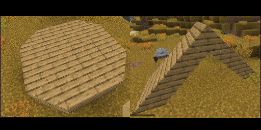

   I also did my first tests with using the new ramps and wedges on a /SimpleShip/.  I built a ship using some of these new shapes and it worked.  I could sail the ship and rotate and the new /blocks/ did exactly as they should have, with one exception - after moving the ship I couldn't break the blocks.

   Turned out to be a very simple problem, the *Material.RED_SANDSTONE_STAIRS* and *Material.BARRIER* were not blocks permitted to be on a ship, but /SimpleShips/ did search for any *ItemDisplay* or *BlockDisplay* or *ArmorStand* entities that were part of the ship and they were allowed.  So my visual entities were moving, my carrier blocks were not.

   I considered and then rejected building some type of integration between the two plugins.  I had avoided doing that previously with the grave stone plugin, so instead I opted for a simpler approach, but one that enhanced /SimpleShips/.  I updated the /SimpleShips/ plugin to define the allowed blocks in the config.yml file instead of having them hard coded.  This had been a planned option but I hadn't gotten around to doing it, now I found I needed it and added it.  Standard iterative development cycle.

   Now, because the blocks allowed were defined in the config, any server that was using both /SimpleShips/ and /Ramps and Wedges/ simply needed to add the configured carrier blocks from /RnW/ to the allowed block list in /SimpleShips/.  I updated both, fired up the server and it worked, almost.

   The carrier blocks now properly moved with the visual *ItemDisplay* entities and I was able to properly break the blocks, but the *ItemDisplay* remained behind.  This related back to the approach where when a carrier block was broken, I was looking for an *ItemDisplay* with the ID key I had created based on the carrier block's placement location.  The carrier block was no longer at the same location so when I used its new location to create the ID, no match was found.  I decided on a simple change here, when a carrier block was broken I would simply check the exact same physical location for an *ItemDisplay* that carried a /Ramps and Wedges/ type tag in its PDC and assume that was the *ItemDisplay* to remove.

   This new change worked, the *ItemDisplay* was now also being removed, but one more issue remained - nothing was being dropped when the block was harvested.  This was again because of the location change.  Our design was still keeping track of the block type in the chunk PDC but now that the block had moved, we couldn't use the location as the data key to see what was there.  I now took another lesson from /SimpleShips/ and /Dead Man's Chest/. Since I was now utilizing an *ItemDisplay* with each placed ramp or wedge, I had an available entity PDC to work with.

   I started down the path of dropping the chunk data store and using the *ItemDisplay* PDC which had a ripple effect on other parts of the code.  As I explained the different changes, the AI did what it had shown me previously, it performed immediate impact analysis across the codebase pointing out all areas I'd need to update.  This time it was my turn to scramble the code, and I asked the AI to level set again and clean up what I had done.  My code reviewer pointed out some additional points to handle but approved the merge.

   I was back now to some polish, specifically the issue that when breaking ramps I was seeing particles, albeit with the default magenta/black texture, but when breaking wedges I wasn't seeing any because we really weren't breaking the barrier blocks.  The AI suggested a simple function to add to the custom break handler we were using and it worked, I now had particles and they were textured right.  I realized I could get the right textures when breaking ramps if I used a custom break handler like the code was doing with wedges, but I decided not to do that for now.  Perhaps later, for now I was now playing with the code, trying different tricks to hide when there were missing faces, but in the end I decided there weren't any tricks I could use so I would just need to adjust my build approaches to avoid the situation.  This will be documented when I publish this plugin.

** Missing Pieces

   Now I was ready for the additional pieces of the roof, hips and valleys to handle the corners.  The AI made this comment

   /The nice part is that the current architecture makes adding them comparatively cheap now. They’d just be more BlockShape values with generated item models and ItemDisplay geometry./

   It pointed out that the only real issue would be the collision box.  I kept testing and added stripped wood to my list of available block types and they didn't work.  Turned out we had hit the expected issue where the *ResourcePackGenerator* was creating the texture name from the block name and it didn't match.  While the block was a *Material.STRIPPED_OAK_WOOD*, the texture it used was /stripped_oak_log.png/.  I did a quick update to check if the block type ended in /_wood/ and if so, create the texture ending in /_log/.  That worked for all wood types. Now I was ready to try adding the hips and valleys and asked the AI to do that.

   The bulk of the work was going to be creating the correct model geometries and deciding on carrier blocks.  I chose to go with using the barrier blocks for the corner pieces instead of a stair carrier for two reasons.  First, because the *Barrier* itself had no normal rendered geometry, it avoided the face-culling problem I had seen with other carriers.  And second, if we used stair blocks the Minecraft engine would alter their geometry to connect them and when that happened, they no longer looked like my blocks.  Using the barrier meant they wouldn't have the stair climbing interaction, but I decided that was an acceptable trade-off.  The end result of this new feature: only two new templates to be processed by the *ResourcePackGenerator*.  The AI produced the JSON files for stone hips and valleys for me to test with.  After I manually updated the resource pack with the new files I tested and they turned out to be smaller than regular blocks.  This was because we hadn't wired these into the stonecutter and I was summoning them as items, which were smaller by default.  They were looking pretty good with this manual testing so I uploaded another full copy of the source code and asked the AI to wire these two new pieces into the baseline.

   Three minutes and fifteen seconds later and I had another download to merge, refactoring was growing in time.  I built the new plugin, started the server, grabbed the generated resource pack and it looked amazing.

#+CAPTION: Stone pyramid
#+ATTR_HTML: :width 256px :height 256px
#+ATTR_LATEX: :width 1in :height 1in
#+ATTR_ORG: :width 256px
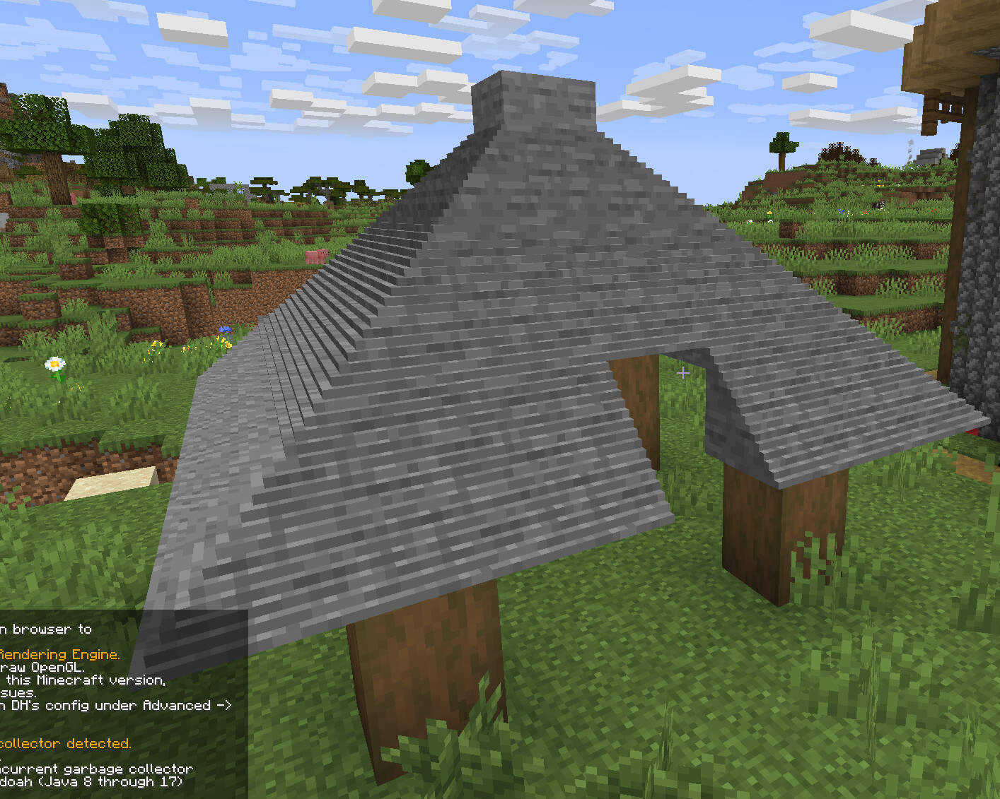

   I asked for another block, a pyramid cap.  After applying the updates I now had roofs, caps, inner and outer corners, and triangular wedges, all working. A bit more testing showed a few more texture name issues, so I updated the code to add a mapping section in the config.  For example, a *Material.SMOOTH_SANDSTONE* uses only the single texture /sandstone_top.png/ for all sides.  The new mapping section in the config allowed fixing any and all issues with simple updates.

   Although I have more ideas for possible additional blocks, such as lower slab versions of the wedges to allow for /curb/ like builds, for now I'm simply using all three of my plugins on my server.  Throughout this journey I have been able to do what I've always done, think of ideas, bounce them off others, build prototypes, learn something new, build with that, take the knowledge to the next project, learn a better way that I could take back to and improve my previous projects, rinse and repeat.  This is the way I've always worked, the difference here has been in the speed at which these steps were accomplished.

#+CAPTION: Some builds with Ramps and Wedges
#+ATTR_HTML: :width 512px :height 256px
#+ATTR_LATEX: :width 2in :height 1in
#+ATTR_ORG: :width 512px
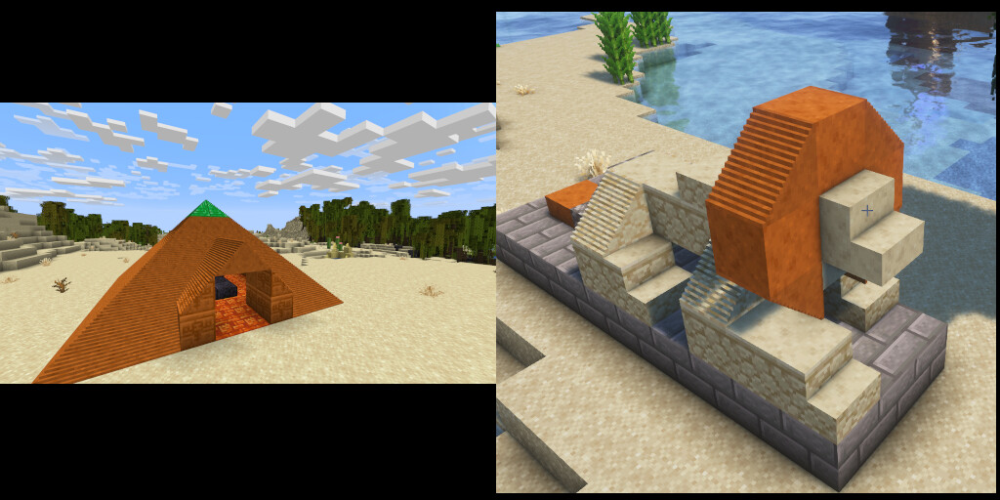  

* Epilogue

   The AI started out as my API expert, my research assistant, and my sounding board when I was building /SimpleShips/.  It augmented my coding where I needed help, such as in the matrix math space and it always provided multiple options that made me stop and evaluate.

   When I started /Dead Man's Chest/, I was relying less on the AI for basic coding knowledge and more on creative solutions.  I had a vision for how this plugin should work and feel, I knew visuals would be key and that I would be dealing with more /states/ than previously. /Dead Man’s Chest/ shifted the balance. I needed less help with basic plugin mechanics and spent more of our conversations evaluating design and architectural choices. In several cases, particularly around persistence, I preferred a simpler object-owned model over the external state-management approaches the AI initially proposed.

   Then coming into the /Ramps and Wedges/, I already knew the shape that plugin would eventually take, I knew that custom models could be used to give custom looking blocks.  I also knew that it would have taken me weeks to figure out those model details, if I ever did, so I was happy to hand the bulk of the work to my collaborator.  The coding was still a joint effort with both sides doing various refactoring, but this project was almost purely visual, not my area of expertise.  The division of labor felt similar to a game-development team, where artists create the assets and developers wire them into the system.
   
   Circling back around to the introduction where there were two sides in the AI debate, those that believe it is possible to replace all development with AI code and those that see all AI code as /slop/, I've come to appreciate that both sides are both right and wrong.
   
   My journey has shown me that AI can replace a surprising amount of work. What I did not find it could replace was engineering judgment and accountability.  The AI behaved like an extremely fast researcher with broad recall. It could take a request, scan a wide solution space, and quickly point toward code, APIs, or tools worth exploring.  But it also showed me that useful results still depended on guidance, context, testing, and judgment.  The AI’s suggestions were usually plausible. But plausible is not the same thing as correct, and every meaningful result still had to survive testing in the actual runtime. The suggestions did not always account for the non-technical concerns that matter in a long-lived system: supportability, maintenance, coupling, operational complexity, and product tradeoffs. On more than one occasion I chose a different path, not because the suggested approach was technically invalid, but because I was weighing complexity, supportability, and maintenance. At times I made choices I knew would be trade-offs, but like any good product owner, I accepted those trade-offs.  Sometimes /good enough/ is truly /good enough/.

   I also think there is some merit to the /slop/ opinion, though I think it is wrong to reactively apply that to all code.  As I learned, I never actually accept the first code produced, much like in my entire career. Even though I might have joked with my team that if /it compiles, great, ship it/, that has never been true.  So taking a first pass of AI generated code and trying to deliver that as a finished project could honestly be /slop/.  But the same is true of taking any first cut of code.  Iterative development came about and is arguably the most widely used development model today because we all recognized that it is the best model for /getting it right/.

   This leaves me with the understanding that both camps are both right and wrong, that AI is a tool that when used properly, as with any tool, is a force multiplier.  Will AI impact the labor market? I think so. Near-term disruption seems likely, while the longer-term balance is much harder to predict.

   Back when the use of the internet was exploding, during the dot-com craze, we were treated to stories of how small teams in a garage were creating valuable businesses.  Today many solo developers produce phone apps that become popular.  What this means for employment is harder to predict. My experience does make me think smaller teams will be capable of work that once required larger ones. History has many examples of where a new tool shows up, it reduces the labor needs, some people are impacted, others profit, but eventually things settle down to a new normal and after the hype winds down, and the tool is being used for real world work, then ideas and new opportunities show up.

   After all of this, what surprised me most was not how much code the AI could produce. It was how familiar the working relationship felt. I had spent years at whiteboards with architects and senior developers, throwing out ideas, challenging assumptions, and leaving with a clearer idea of what to build next. The tools changed again. The engineering process did not.
